# Introduction to Windows Command Line

Created by: **4bh1-03**

This write-up documents my learning journey through the **`Junior Cybersecurity Analyst path: Introduction to Windows Command Line`**.

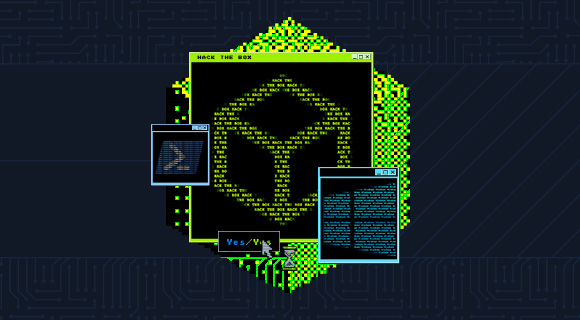

The purpose of this module is to build a strong foundational understanding of the Windows Command Line environments — specifically **CMD** and **PowerShell** — from a security and system-administration perspective. While many interact with Windows through its GUI, mastering the command line is essential for automation, system interrogation, and performing deep-dive security tasks that aren’t possible through a standard interface.

Throughout this module, I explore:

- **Navigating the File System:** Mastering directory structures and file manipulation via CLI.
- **System Interrogation:** Using commands to extract OS details, network configurations, and running processes.
- **PowerShell Basics:** Introduction to the object-oriented nature of PowerShell and its verb-noun syntax.
- **Administrative Tasks:** Managing users, permissions, and services directly from the shell.

> **Disclaimer:**
> 
> 
> This write-up is intended to complement your learning, not replace it. I highly recommend going through the full module on **HackTheBox (HTB)** for a thorough understanding of the concepts. To maintain the platform’s integrity, I have not included answers for straightforward, theory-based questions that can be easily found within the module text. The focus of this post is to provide guided, detailed solutions for the more challenging tasks and hands-on lab exercises.
> 

---

To connect to the target hosts as the user via SSH, utilize the following format:

```bash
ssh <user>@<IP-Address>
```

Once connected, you will be asked to accept the host’s certificate and provide the user’s password to log in completely. After you authenticate, you are free to dive in. Since most of the questions in the beginning sections are easy, we will directly start from the sixth section.

---

# Section 6 : Gathering System Information

When performing host enumeration via the Command Prompt, these are the essential tools every analyst should have in their arsenal:

| **Category** | **Command** | **Primary Purpose** | **Key Insight Provided** |
| --- | --- | --- | --- |
| **System Info** | `systeminfo` | Full System Overview | OS version, hotfixes, and uptime/boot time. |
|  | `hostname` | Name Identification | Returns the specific machine name. |
|  | `ver` | OS Build Check | Exact OS version; used to find build-specific exploits. |
| **Networking** | `ipconfig /all` | TCP/IP Configuration | Deep dive into DNS, DHCP, and MAC addresses. |
|  | `arp -a` | ARP Cache | Identifies recently contacted hosts on the local network. |
| **Identity** | `whoami` | Current User | Confirms current user and domain context. |
|  | `whoami /priv` | Privilege Audit | Lists enabled/disabled security tokens (e.g., *SeImpersonatePrivilege*). |
|  | `whoami /groups` | Group Membership | Identifies if the user is part of high-privilege groups. |
| **Net Utility** | `net user` | User Enumeration | Lists all local accounts on the system. |
|  | `net localgroup` | Group Discovery | Shows all local groups (Administrators, Users, etc.). |
|  | `net share` | Shared Resources | Finds open folders or printers exposed on the host. |
|  | `net view` | Network Mapping | Lists visible computers and shares within the domain. |

## **1. What command will output verbose system information such as OS configuration, security info, hardware info, and more?**

**Answer :** `systeminfo` 

## **2. Access the target host and run the ‘hostname’ command. What is the hostname?**

First `ssh` to the target IP using the given `username` and `password`. You will enter into a PowerShell session, where you have enter the `hostname` command.

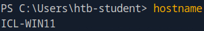

**Answer :** `ICL-WIN11`

---

# Section 7 : Finding Files and Directories

Efficiently locating and analyzing files is a skill that separates beginners from power users. Whether you are hunting for a specific log file or comparing two versions of a script, these commands are essential:

- **`where`**: Locates files within the system's search path. Use the **`/R`** switch to perform a recursive search through a specific directory hive.
- **`find`**: A basic tool used to search for specific text strings within a file. It is useful for quick checks but lacks advanced pattern matching.**Key Modifiers:** **a) `/V`** (show lines that *don't* match) b) **`/N`** (show line numbers)c) **`/I`** (ignore case).
- **`findstr`**: The `"grep”` of Windows. This is a much more powerful version of `find` that supports regular expressions (regex) and complex search patterns.

## **1. What command can be used to search for regular expression strings from command prompt?**

**Answer :** `findstr` 

## **2. Using the skills acquired in this and previous sections, access the target host and search for the file named ‘waldo.txt’. Submit the flag found within the file.**

By default you will be given the PowerShell session. Since the above mentioned commands work only in the Command Prompt, you have to first enter into a Command Prompt session by typing **`cmd`** or **`cmd.exe`** , after which you are good to execute the below commands.

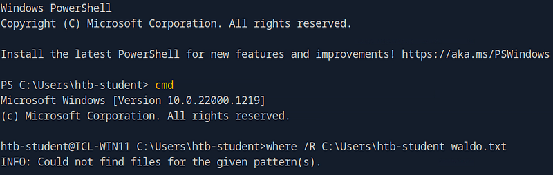

At first, it prints `INFO: Could not find files for the given pattern(s)`. So we get to know that the file which we are looking for is not under the user **`htb-student`** . Next we search recursively under all the users and find it under the user **`MTanaka`**.

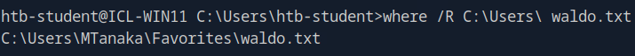

```powershell
where /R C:\Users\ waldo.txt
```

To view the content of `waldo.txt` we use :

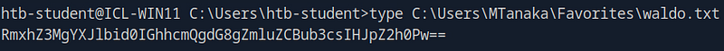

```powershell
type C:\Users\MTanaka\Favorites\waldo.txt
```

**Answer :** `RmxhZ3MgYXJlbid0IGhhcmQgdG8gZmluZCBub3csIHJpZ2h0Pw==`

---

# Section 9 : Managing Services

The **Service Controller (`sc.exe`)** is a powerful command-line utility used to communicate with the **Service Control Manager (SCM)**. It allows for the management, configuration, and retrieval of status information for Windows services and drivers, both locally and on remote systems.

**Core `sc` Commands & Usage**

| **Command** | **Action** | **Description** |
| --- | --- | --- |
| **`sc query`** | Enumerate Status | Lists active services and drivers. Use `type= service` or `state= all` for specific filters. |
| **`sc queryex`** | Extended Query | Provides additional info like the **PID** and flags (useful for identifying process-to-service mapping). |
| **`sc start`** | Start Service | Sends a start request. Note: Services may stay in `START_PENDING` while initializing. |
| **`sc stop`** | Stop Service | Sends a stop request. High-privilege services (like `windefend`) may return **Access Denied**. |
| **`sc qc`** | Query Config | Displays configuration info, including the **Binary Path** and the account it runs under. |
| **`sc config`** | Modify Config | Changes service parameters (e.g., `start= disabled`). Changes are saved in the Registry. |
| **`sc pause/continue`** | Control State | Pauses or resumes a service without fully terminating the process. |

**Alternative Service Enumeration Tools**

While `sc` is the primary tool, these alternatives provide different perspectives:

- **`tasklist /svc`**: Maps running processes (PIDs) directly to the services they host.
- **`net start`**: Quickly lists all currently running services in a simple text format.
- **`wmic service list brief`**: Provides a detailed table including `StartMode` and `Status` (Note: WMIC is deprecated in newer Windows versions).

**Critical Tips for Success**

- **The Space Rule:** For `sc` parameters, the space after the equals sign is **mandatory**.
    - *Correct:* `sc config wuauserv start= disabled`
    - *Incorrect:* `sc config wuauserv start=disabled`
- **Permissions:** Stopping/Modifying core security services (like Windows Defender) often requires **SYSTEM** level privileges; even a Local Administrator may be denied access.
- **Persistence:** Modifications made via `sc config` persist across reboots, which can be used to permanently disable security updates or maintain persistence.

## **1. What command string will stop a service named 'red-light'? (full command as the answer)**

**Answer :** `sc stop red-light`

---

# Section 13 : User and Group Management

Effective user and group management is a cornerstone of both system administration and security auditing. In Windows environments, mastering these commands allows you to control resource access, identify misconfigurations, and manage the boundary between local host security and global Active Directory permissions.

| **Category** | **Command** | **Scope** | **Purpose** |
| --- | --- | --- | --- |
| **Enumeration** | `Get-LocalUser` | Local | Lists all local accounts and their status (Enabled/Disabled). |
|  | `Get-LocalGroup` | Local | Displays all local security groups on the host. |
|  | `Get-ADUser -Filter *` | Domain | Retrieves all user objects within the Active Directory domain. |
|  | `Get-ADGroup -Filter *` | Domain | Lists all groups configured within the domain environment. |
| **Membership** | `Get-LocalGroupMember -Group "[Name]"` | Local | Shows all users or groups belonging to a specific local group. |
|  | `Get-ADGroupMember -Identity "[Name]"` | Domain | Lists the members of a specific Active Directory group. |
| **Creation** | `New-LocalUser -Name "[Name]"` | Local | Creates a new local user account on the machine. |
|  | `New-ADUser -Name "[Name]"` | Domain | Provisions a new user account in the Active Directory database. |
|  | `New-LocalGroup -Name "[Name]"` | Local | Creates a new local security group. |
| **Modification** | `Set-LocalUser -Name "[Name]" -Description "..."` | Local | Updates properties of a local user (e.g., password, description). |
|  | `Set-ADUser -Identity "[Name]" -Replace @{...}` | Domain | Modifies specific attributes of a domain user object. |

## 1. **What resource can provide Windows environments with directory services to manage users, computers, and more? (full name not abbreviation)**

**Answer :** `Active Directory` 

## 2. **What PowerShell Cmdlet will display all LOCAL users on a host?**

**Answer :** `Get-LocalUser` 

## 3. **Connect to the target host and search for a domain user with the given name of Robert. What is this users Surname?**

Given target host : `10.129.203.105` 

First check if the **`ActiveDirectory`** Module is loaded into the current session by running 
the cmdlet :

```powershell
Get-Module
```

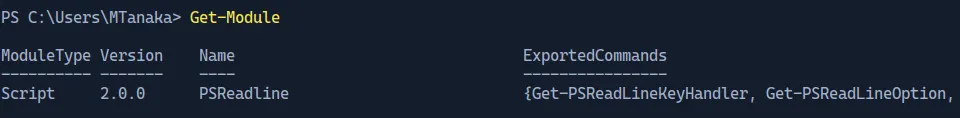

By default it won’t be loaded into the current session. So, check if its available in the list of modules that can be imported by running the cmdlet :

```powershell
Get-Module -ListAvailable -Name "ActiveDirectory"
```

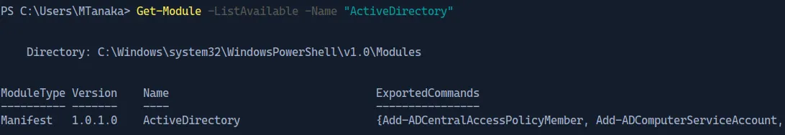

Ok, so now that it is available to import, import it into the current session by enterin the below cmdlet :

```powershell
Import-Module ActiveDirectory
```

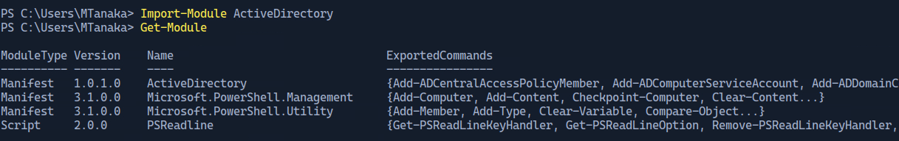

So, now that we have the `ActiveDirectory` module in the current session, we can lookup for domain user with the given name `Robert` .

```powershell
Get-ADUser -Filter {GivenName -like "Robert"}
```

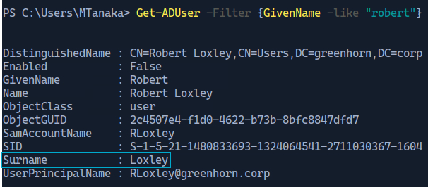

**Answer :** `Loxley`

---

# Section 22 : Skill Assessment

Each question has a corresponding `user` with whom you will need to authenticate to complete the questions. In each challenge, you may be asked to perform specific actions, use specific executables, or find information on the host to get the flag for that question.

In most instances, the flag for the previous user must be used as the SSH password for the following user (i.e., the flag for user2 is the password for user3 to SSH in, and so on).

Given target : **`10.129.204.9`**

## **1. The flag will print in the banner upon successful login on the host via SSH.**

> SSH to  **`<target>`,** with user **`user0`** and password **`Start!`**
> 

```bash
ssh target>@user0
```

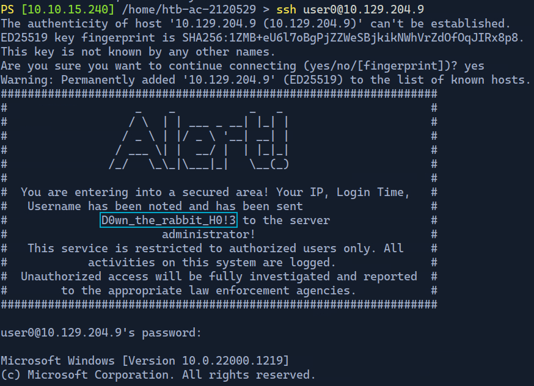

**Answer :** `D0wn_the_rabbit_H0!3` 

Exit from the current session by entering the command `exit` for the next question.

## **2. Access the host as user1 and read the contents of the file "flag.txt" located in the users Desktop.**

> SSH to  **`<target>`,** with user **`user1`** and password **`D0wn_the_rabbit_H0!3`**
> 


Enter into a PowerShell session by typing the command `powershell` 


To list the files on user1’s Desktop use the command : 

```powershell
ls .\Desktop\

OR

gci .\Desktop\
```


To view the contents of `flag.txt` use the command :


**Answer :** `Nice and Easy!` 

## 3. **If you search and find the name of this host, you will find the flag for user2.**

> SSH to  **`<target>`,** with user **`user2`** and password **`Nice and Easy!` .**
> 

Hostname of a particular host can be found using the command : 

```powershell
hostname
```


**Answer :** `ACADEMY-ICL11` 

Exit from user1’s session by typing `exit` .

## 4. **How many hidden files exist on user3's Desktop?**

> SSH to  **`<target>`,** with user **`user3`** and password **`ACADEMY-ICL11` .**
> 

To list the hidden files in  the user3’s Desktop use the below command : 

```powershell
Get-ChildItem .\Desktop\ -Hidden
```


The below commands can be used to count the number of hidden files in the user3’s Desktop:

```powershell
Get-ChildItem .\Desktop\ -Hidden -File | Measure-Object

OR

(Get-ChildItem .\Desktop\ -Hidden -File).Count
```


**Answer :** `101`

Exit from user3’s session by typing `exit` .

## 5. **User4 has a lot of files and folders in their Documents folder. The flag can be found within one of them.**

> SSH to  **`<target>`,** with user **`user4`** and password **`101` .**
> 

Let’s first check how many files and folders are there in user4’s Documents folder


Damn, there are 10 directories and a lot of `flag.txt` files inside them. To get more information about each file, let’s enter a PowerShell session and use its object filtering techniques.


Since there are a lot of files, let’s check the length of each `flag.txt` file recursively, printing the directory and length of each file.

```powershell
Get-ChildItem -Path C:\Users\user4\Documents\ -Filter flag.txt -Recurse -File | 
Select-Object FullName, Length
```


Almost all `flag.txt` are empty. There must be one **`flag.txt`** file in some of the directories with a non-zero length. So let’s filter it down further with another condition :

```powershell
Get-ChildItem -Path C:\Users\user4\Documents\ -Filter flag.txt -Recurse -File | 
Where-Object { $_.Length -ne 0 } | 
Select-Object FullName, Length
```


Let’s go, we find a `flag.txt` file with a Length of `44` Bytes having the Path `C:\Users\user4\Documents\3\4\flag.txt` .

Now we can simply view the contents of the file which is the requird flag, by executing the following command :

```powershell
type C:\Users\user4\Documents\3\4\flag.txt
```


**Answer :** `Digging in The nest` 

## 6. **How many users exist on this host? (Excluding the DefaultAccount and WDAGUtility)**

> SSH to  **`<target>`,** with user **`user5`** and password **`Digging in The nest` .**
> 

We will be using the `Get-LocalUser` to get the users that exist on the host.

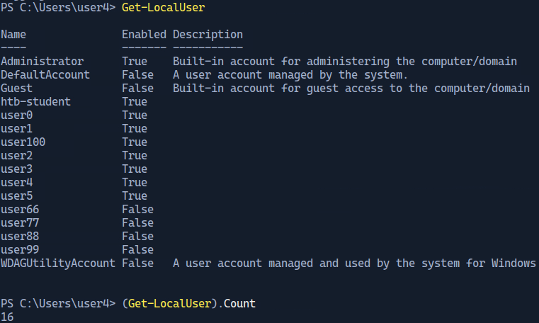

Exclude **2** (**DefaultAccount and WDAGUtility**) from the count to get the answer.

**Answer :** `14` 

## 7. **For this level, you need to find the Registered Owner of the host. The Owner name is the flag.**

> SSH to  **`<target>`,** with user **`user6`** and password **`14` .**
> 

The below command  can be used to gather a lot of information from the host including the registered owner of the host :

```powershell
systeminfo 
```

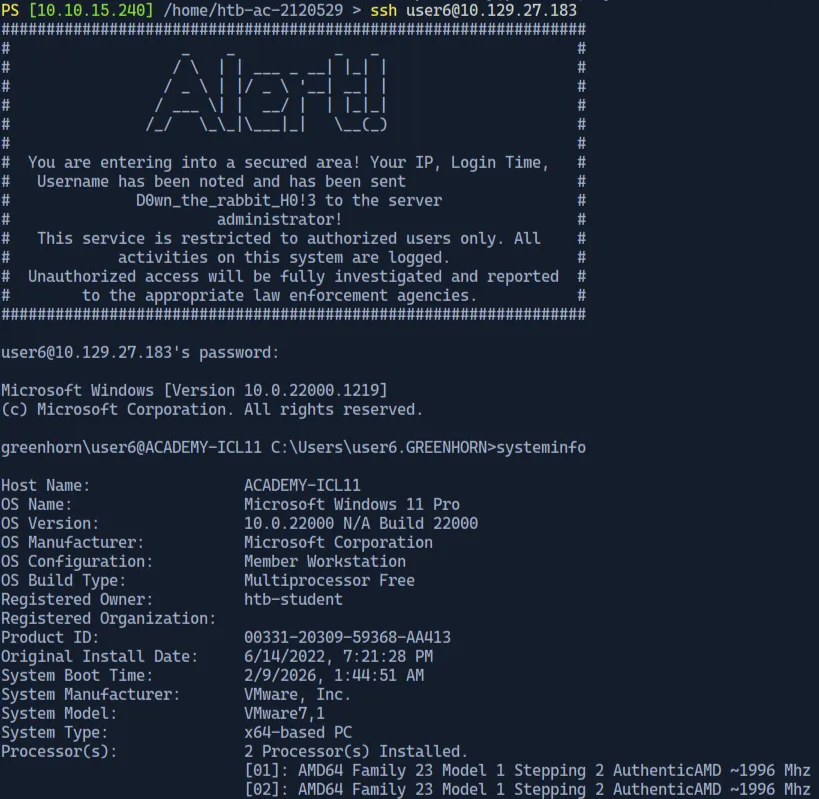

**Answer :** `htb-student` 

## 8. **For this level, you must successfully authenticate to the Domain Controller host at 172.16.5.155 via SSH after first authenticating to the target host. This host seems to have several PowerShell modules loaded, and this user's flag is hidden in one of them.**

> SSH to  **`<target>`,** with user **`user7`** and password **`htb-student` .**
> 

> SSH to the Domain Controller host at **`172.16.5.155`** with user **`user7`** and password **`htb-student`** and open up a PowerShell session.
> 


We can see that there is a Module named `Flag-Finder` already in the current session with the command `Get-Flag` . Let’s try getting help for the command `Get-Flag` .

```powershell
Get-Help Get-Flag
```


This shows that the command can be used as a standalone command and can be executed without any parameters. So let’s execute the command :

```powershell
Get-Flag
```


**Answer :** `Modules_make_pwsh_run!` 

## 9. **This flag is the GivenName of a domain user with the Surname "Flag".**

To get details about a domain user, we use the command `Get-ADUser` . But since we have to find a domain user whose `Surname` is `Flag` , we will use the below command to filter out unwanted domain users :

```powershell
Get-ADUser -Filter 'Surname -eq "Flag"'
```

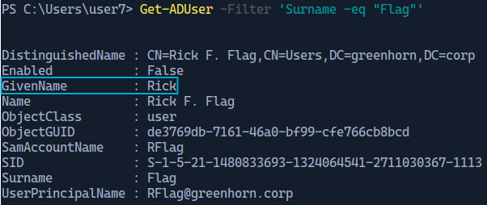

**Answer :** `Rick` 

## 10. **Use the tasklist command to print running processes and then sort them in reverse order by name. The name of the process that begins with "vm" is the flag for this user.**

Since `tasklist` is a cmd command, first switch to a cmd session by typing `cmd` .

To get the name of proccesses sorted in a descending order, we can pipe the output of `tasklist` command to the `sort` command with the `/R` switch to sort it in a reverse order.

```powershell
tasklist | sort /R
```

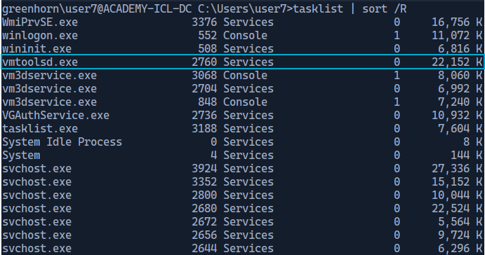

**Answer :** `vmtoolsd.exe` 

## 11. **What user account on the Domain Controller has many Event ID (4625) logon failures generated in rapid succession, which is indicative of a password brute forcing attack? The flag is the name of the user account.**

```powershell
Get-WinEvent -FilterHashTable @{LogName='Security'; ID=4625} |
ForEach-Object { $_.Properties[5].Value } |
Group-Object |
Sort-Object Count -Descending
```

The command retrieves Security event logs with Event ID 4625 (failed logon attempts) using `Get-WinEvent`. The output is piped to `ForEach-Object`, which extracts the failed username from the event’s Properties array (`Properties[5]`). These usernames are then grouped using `Group-Object` to count how many failed attempts each account has. Finally, `Sort-Object Count -Descending` sorts the results so the account with the most failed logons appears first, helping identify potential brute-force attack targets.

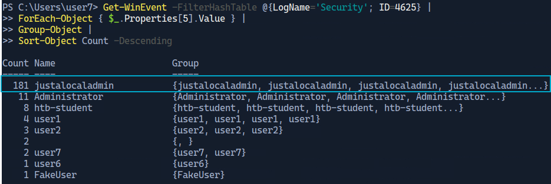

**Answer :** `justalocaladmin` 

---