# Linux Fundamentals

Created by: **4bh1-03**

Hello everyone! I’m currently diving into the **`Linux Fundamentals`** module on **`Hack The Box`** under the **`Junior Cybersecurity Analyst`** job role path. I decided to create a walkthrough of the solutions of interactive sections to help others and solidify my own understanding.


Let’s first see how to connect to the target machine using ssh :

```bash
ssh htb-student@[ip_address]
//Make sure to remove the square brackets after pasting the ip address.
//Then enter the password when asked
```

Now let’s get started with the first section: System Information!

---

# **Section 1 : System Information**

### **1. Find out the machine hardware name and submit it as the answer.**

- `uname`: The core command for printing system information.
- `m` : This flag tells `uname` to print only the machine's hardware architecture name.

```bash
uname -m
```

Here is the command executed on the HTB terminal:

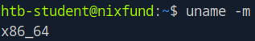

**Answer :** `x86_64` 

### **2. What is the path to htb-student’s home directory?**

```bash
pwd
```

Here is the command executed on the HTB terminal:

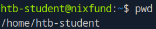

**Answer :** `/home/htb-student`

### **3. What is the path to the htb-student’s mail?**

```bash
cd /
cd /var
ls
cd /mail/htb-student
pwd
```

**Answer :** `/var/mail/htb-student`

### **4. Which shell is specified for the htb-student user?**

```bash
echo "$SHELL"
```

Here is the command executed on the HTB terminal:

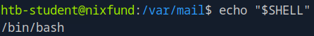

**Answer :** `/bin/bash`

### **5. Which kernel release is installed on the system? (Format: 1.22.3)**

- `r` : This flag tells `uname` to print only the kernel release version.

```bash
uname -r
```

Here is the command executed on the HTB terminal:

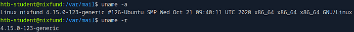

**Answer :** `4.15.0`

### **6. What is the name of the network interface that MTU is set to 1500?**

The `ifconfig` (interface configuration) command is a command-line utility used to view and manage the network interfaces on a system. It allows you to see details like `IP addresses`, `MAC addresses`, and enable or disable network cards.

```bash
ifconfig
```

Here is the command executed on the HTB terminal:

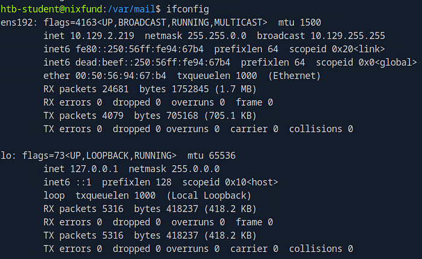

**Answer :** `ens192`

---

# **Section 2: Navigation**

### **1. What is the name of the hidden “history” file in the htb-user’s home directory?**

- `a` : This flag tells `ls` to output all files (including the ones starting with `.` and `..`)

```bash
ls -la
```

Here is the command executed on the HTB terminal:

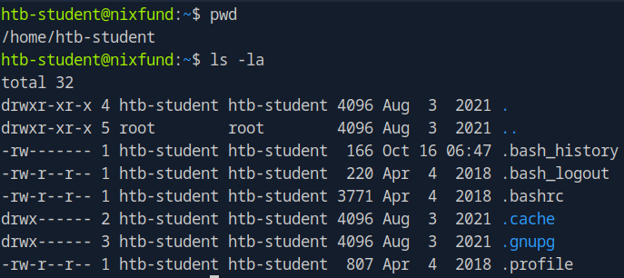

**Answer :** `.bash_history`

### **2. What is the index number of the “sudoers” file in the “/etc” directory?**

> ***What is an Inode (Index Number)?***
> 
> 
> *An **inode** (short for **index node**) is a **data structure** on a Linux filesystem that stores all the information about a file or directory **except** for its name and its actual data.*
> 

The command `ls -i <file/directory>` lists files and directories along with their **inode number**.

**Command breakdown:**

- **`ls`**: The base command to **l**i**s**t directory contents.
- **`i`**: The flag for `-inode`. It instructs `ls` to print the index number (the inode) of each file.
- **`<file/directory>`**: The target you want to list. If you don't specify one, it defaults to the current directory.

```bash
cd /etc
ls -i sudoers
```

Here is the command executed on the HTB terminal:

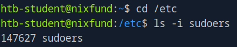

**Answer :** `147627`

---

# **Section 3: Working with Files and Directories**

### **1. What is the name of the last modified file in the “/var/backups” directory?**

- `t` : This flag sorts the output by modification **t**ime, placing the newest items at the top.

```bash
ls -lt
```

Here is the command executed on the HTB terminal:

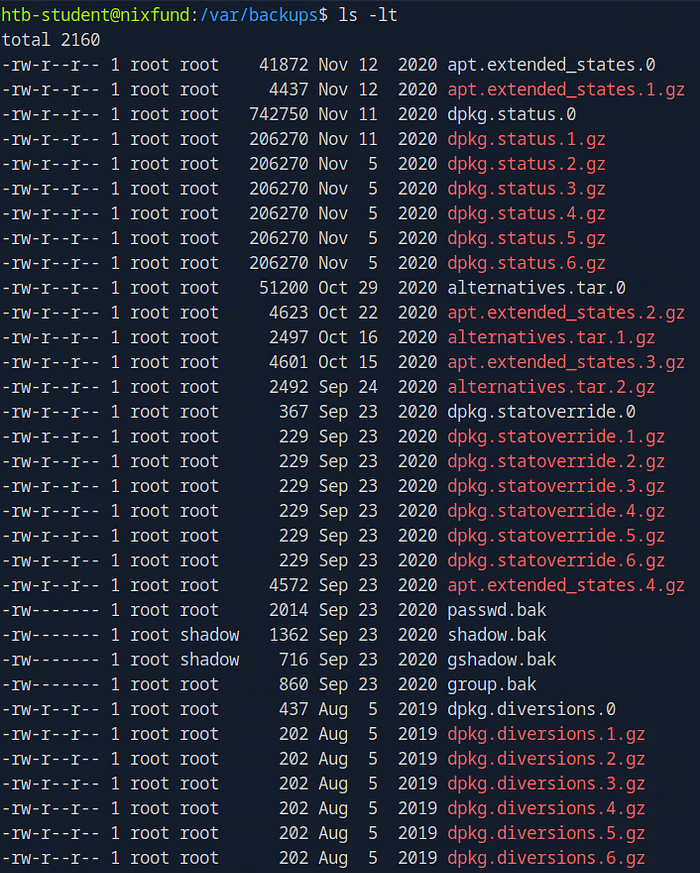

**Answer :** `apt.extended_states.0`

### **2. What is the inode number of the “shadow.bak” file in the “/var/backups” directory?**

```bash
cd /var/backups
ls -i shadow.bak
```

Here is the command executed on the HTB terminal:

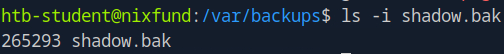

**Answer :** `265293`

---

# **Section 4: Find Files and Directories**

### **1. What is the name of the config file that has been created after 2020–03–03 and is smaller than 28k but larger than 25k?**

```bash
find / -name *.conf newermt 2020-03-03 -size +25k -size -28k 2>/dev/null
```

**Command breakdown:**

- **`find`**: The base command used to search for files and directories. Since the path mentioned is `/` , it searches from the root directory.
- **`name *.conf`**: This test looks for files whose names end with `.conf`. The  is a wildcard matching any characters.
- **`newermt 2020-03-03`**: This finds files that were **`m**odified **t**ime` is **`newer`** than the specified date (March 3rd, 2020).
- **`size +25k`**: This finds files that are larger than (+) 25 kilobytes.
- **`size -28k`**: This finds files that are smaller than (-) 28 kilobytes.
- **`2>/dev/null`**: This part handles errors. It redirects the standard error stream (`2>`) to `/dev/null`, which is a special file that discards all data written to it. This effectively hides "Permission denied" errors that might appear when `find` tries to search protected directories.

Here is the command executed on the HTB terminal:

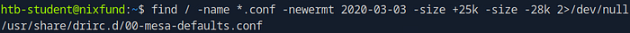

**Answer :** `00-mesa-defaults.conf`

### **2. How many files exist on the system that have the “.bak” extension?**

```bash
find / -name *.bak 2>/dev/null | wc -l
```

**Command breakdown:**
The command is made of two parts connected by a pipe (`|`). The output of the first command becomes the input for the second one.

**1. `find / -name "*.bak" 2>/dev/null`**

- **`find /`**: This initiates a search starting from the root directory (`/`), which means it will scan the entire filesystem.
- **`name *.bak`**: This is the search criteria. It looks for files whose names end with the `.bak` extension.
- **`2>/dev/null`**: This part handles errors. This effectively hides “Permission denied” errors that might appear when `find` tries to search protected directories.
- **Output**: The result of this part is a list of every found file’s full path, with each path on a new line.

**2. `wc -l`**

- **`|`**: The pipe takes the list of file paths generated by `find` and "pipes" it as input to the next command.
- **`wc -l`**: The **w**ord **c**ount command with the `l` flag counts the number of **l**ines in its input.

Here is the command executed on the HTB terminal:

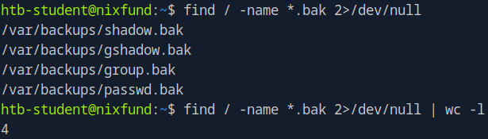

**Answer :** `4`

### **3. Submit the full path of the “xxd” binary.**

```bash
which xxd
```

Here is the command executed on the HTB terminal:

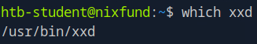

**Answer :** `/user/bin/xxd`

---

# **Section 5: File Descriptors and Redirections**

### **1. How many files exist on the system that have the “.log” file extension?**

```bash
find / -name *.log 2>/dev/null | wc -l
```

Here is the command executed on the HTB terminal:

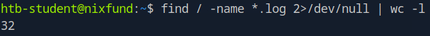

**Answer :** `32`

### **2. How many total packages are installed on the target system?**

```bash
apt list --installed | grep installed | wc -l
```

**Command breakdown:**

The command uses a pipeline (`|`) to send the output of one command as the input to the next.

**1. `apt list --installed`**

- This command lists all packages that are currently installed on the system. The output for each package includes its name, version, and a status marker like `[installed]`.

**2. `grep installed`**

- The output from the first command is “piped” to `grep`.
- `grep` acts as a filter, only allowing lines that contain the word **"installed"** to pass through. Since every package line from the previous command already contains this word, this step effectively isolates the package entries and filters out any header or footer lines from the `apt` command's output.

**3. `wc -l`**

- The filtered list of installed packages is then piped to `wc` (word count).
- The **`l`** flag tells `wc` to count the number of **l**ines.

Here is the command executed on the HTB terminal:

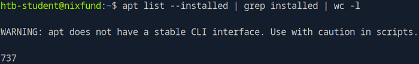

**Answer :** `737`

---

# **Section 6: Filter Contents**

### **Solutions for Practice Questions:**

The below questions use the **`/etc/passwd`** file

1. A line with the username `cry0l1t3`.

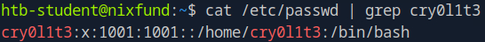

2. The usernames.

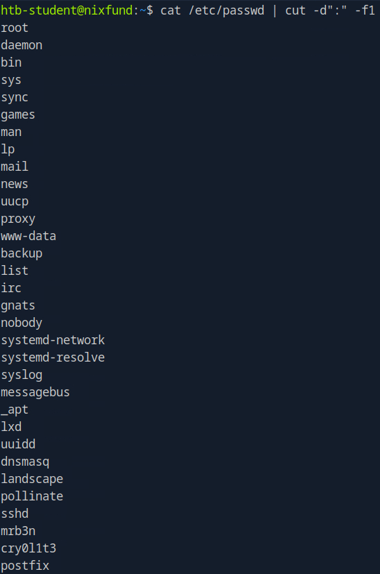

3. The username `cry0l1t3` and his UID.

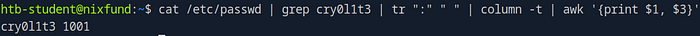

4. The username `cry0l1t3` and his UID separated by a comma (`,`).

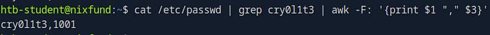

5. The username `cry0l1t3`, his UID, and the set shell separated by a comma (`,`).

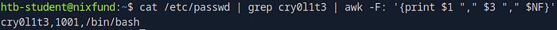

6. All usernames with their UID and set shells separated by a comma (`,`).

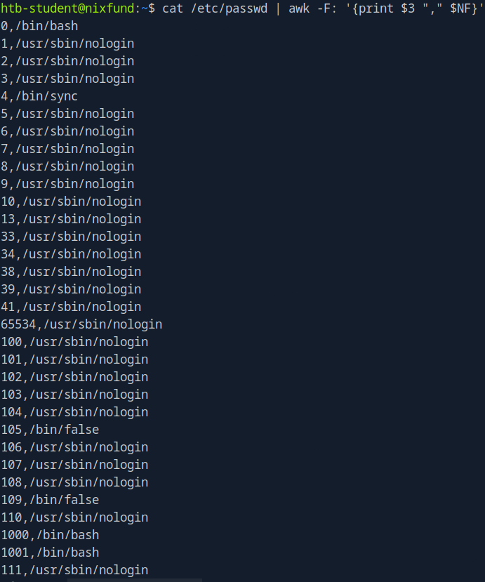

7. All usernames with their UID and set shells separated by a comma (`,`) and exclude the ones that contain `nologin` or `false`.

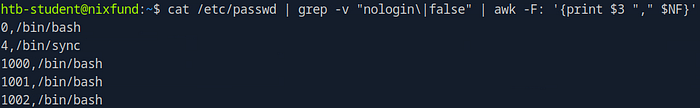

8. All usernames with their UID and set shells separated by a comma (`,`) and exclude the ones that contain `nologin` and count all lines of the filtered output.

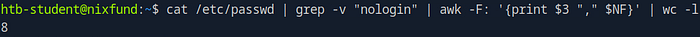

### Solutions for Section Questions:

### **1. How many services are listening on the target system on all interfaces? (Not on localhost and IPv4 only)**

```bash
netstat -l | grep "tcp" | grep "0.0.0.0" | grep -v "localhost"
```

**Command Breakdown:**

The command uses a pipeline (`|`) to filter the results at each step:

1. **`netstat -l`** Lists all sockets that are in a **l**istening state, waiting for incoming connections.
2. **`| grep "tcp"`** Takes that list and filters it to show **only** lines containing "tcp" (this will include both `tcp` and `tcp6` services).
3. **`| grep "0.0.0.0"`** Takes the list of listening TCP sockets and filters it again, showing **only** lines that contain `0.0.0.0`. This special address means the service is listening on **all available IPv4 interfaces** (e.g., your Wi-Fi IP, Ethernet IP, etc.), not just the loopback interface (`127.0.0.1`).
4. **`| grep -v "localhost"`** Takes the remaining list and filters it one last time. The `v` flag **inverts** the search, so it **removes** any line that contains the word "localhost". This is a final check to ensure you're only seeing services that are truly exposed to the network.

**OR you can also use**

```bash
ss -lnt "src 0.0.0.0:*"
```

**Command breakdown:**

**`ss`**: This stands for **s**ocket **s**tatistics. It's the modern, fast replacement for `netstat`.

**1. `ss -lnt`** This is the main command and its flags, which are combined.

- **`ss`**: The core **s**ocket **s**tatistics command.
- **`l`**: Filters the results to show only **l**istening sockets.
- **`n`**: Displays **n**umeric addresses and port numbers (this prevents `ss` from resolving `0.0.0.0` to a hostname).
- **`t`**: Restricts the output to **T**CP sockets only.

**2. `'src 0.0.0.0:*'`** This is the filter expression that tells `ss` what to match.

- **`src`**: Specifies that we are filtering by the **s**ou**rc**e address.
- **`0.0.0.0`**: This special address means the service is listening on **all available IPv4 interfaces** (e.g., your Wi-Fi IP, Ethernet IP, etc.), not just the loopback.
- **`:*`**: This is a wildcard that matches any port number.

Here is the command executed on the HTB terminal:

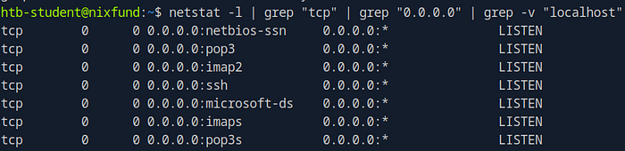

Count the number of services or pipe the output to `wc -l` to get the final answer

**Answer :** `7`

### **2. Determine what user the ProFTPd server is running under. Submit the username as the answer.**

```bash
ps -aux | grep "prpftpd"
```

**Command Breakdown:**

- **`ps aux`**: This lists **a**ll running processes (`a`), in a **u**ser-oriented format (`u`), including those not attached to a terminal (`x`).
- **`|`**: This "pipe" sends the output of the `ps` command to the next command.
- **`grep proftpd`**: This filters the process list, showing only the lines that contain the string "proftpd".

Here is the command executed on the HTB terminal:

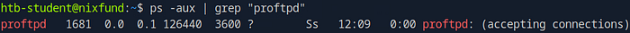

**Answer :** `proftpd`

### **3. Use cURL from your Pwnbox (not the target machine) to obtain the source code of the “https://www.inlanefreight.com" website and filter all unique paths (https://www.inlanefreight.com/directory" or “/another/directory”) of that domain. Submit the number of these paths as the answer.**

```bash
curl "https://www.inlanefreight.com" | grep "https://www.inlanefreight.com/"
| tr " " "\n" | sort -u | grep -E "src|href" | wc -l
```

**Command breakdown :**

The command uses a pipeline (`|`) to send the output of one command as the input for the next.

**1. `curl "https://www.inlanefreight.com"`** Fetches the raw HTML source code of the website and prints it to the terminal.

**2. `| grep "https://www.inlanefreight.com/"`** Takes the HTML and filters it, keeping **only** the lines that contain the string `"https://www.inlanefreight.com/"`. This isolates all the absolute internal links.

**3. `| tr " " "\n"`** Takes the filtered lines and **tr**anslates every **space** character into a **newline** character. This effectively splits every HTML attribute (like `href="..."` or `src="..."`) onto its own separate line.

**4. `| sort -u`** Takes the massive list of single-line attributes and does two things:

- **`sort`**: Sorts them alphabetically.
- **`u`**: Keeps only **u**nique entries, discarding all duplicates.

**5. `| grep -E "src|href"`** Takes the sorted, unique list of attributes and filters it again.

- **`E`**: Enables **E**xtended Regular Expression.
- **`"src|href"`**: This pattern matches any line that contains either the string `src` (for images, scripts) *or* the string `href` (for links, stylesheets).
- **`| wc -l`** Takes the final list of unique `src` and `href` attributes and performs a **w**ord **c**ount with the `l` flag, which counts the total number of **l**ines.

Here is the command executed on the HTB terminal:

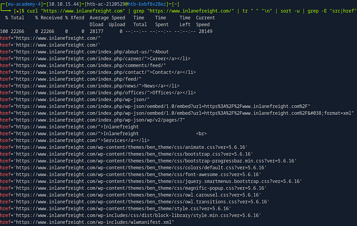

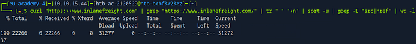

To get the final answer subtract 3 (the first 3 lines) from 37.

**Answer :** `34`

---

# **Section 7: Regular Expressions**

### **Solutions for Practice Questions:**

The below questions use the **`/etc/ssh/sshd_config`** file

1. Show all lines that do not contain the `#` character.

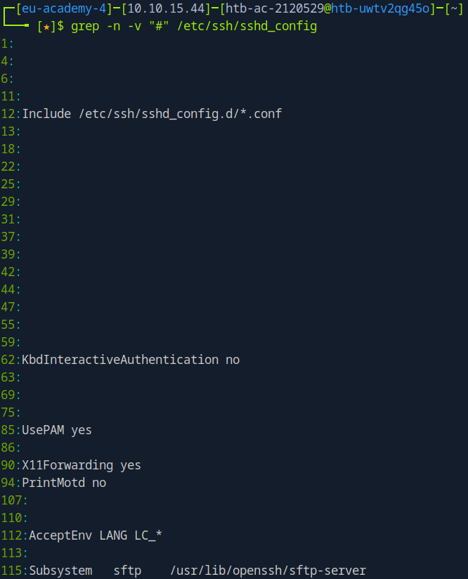

2. Search for all lines that contain a word that starts with `Permit`.

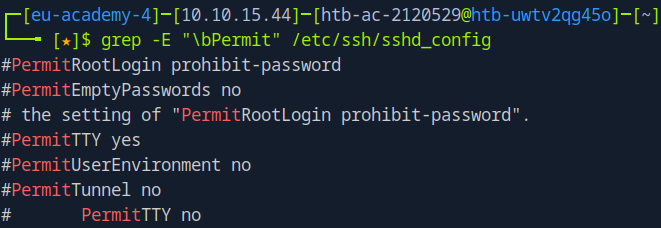

3. Search for all lines that contain a word ending with `Authentication`.

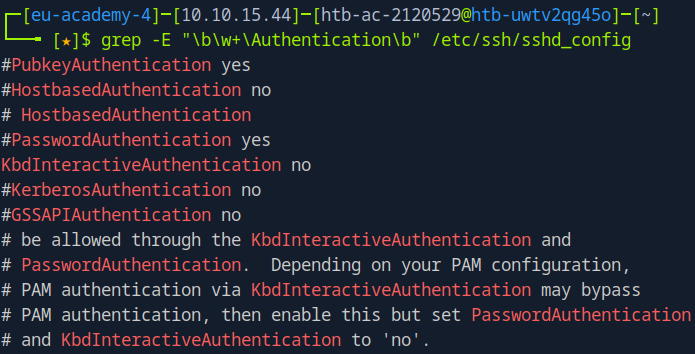

4. Search for all lines containing the word `Key`.

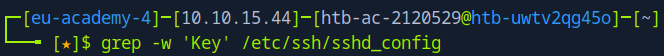

5. Search for all lines beginning with `Password` and containing `yes`.

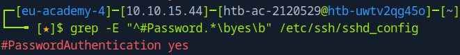

6. Search for all lines that end with `yes`.

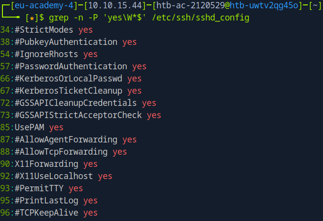

Summarizing some characters and metacharacters used in the above examples :

- **`\W*`**: Matches zero or more **non-word characters** (like spaces).
- **`\w+` :** Matches one or more consecutive **word characters**.
- **`$`**: Asserts that this is the absolute **end of the line**.
- **`\b`** : This is a **word boundary**. It ensures the match starts at the beginning of the word
- **`^`** : Asserts that this is the **beginning of the line.**

---

# **Section 8: User Management**

### **1. Which option needs to be set to create a home directory for a new user using “useradd” command?**

You can find it out by running the command :

```bash
man useradd
```

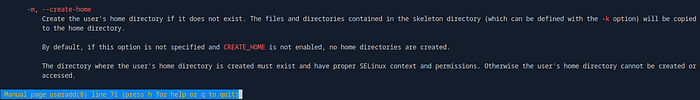

**Answer :** `-m`

### **2. Which option needs to be set to lock a user account using the “usermod” command? (long version of the option)**

```bash
man usermod | grep 'lock'
```

Here is the command executed on the HTB terminal:

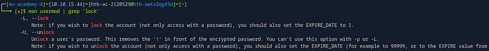

**Answer :** `--lock`

### **3. Which option needs to be set to execute a command as a different user using the “su” command? (long version of the option)**

To execute a specific command as a different user with `su`, you use the long option **`--command`**.

The syntax is: `su [username] --command "<command_to_run>"`

This executes only the specified command as the target user, rather than starting a new interactive shell. The short version of this option is `-c`.

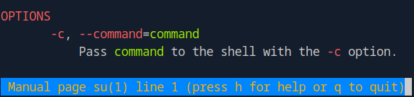

**Answer :** `--command`

---

# **Section 9: Services and Process Management**

### **1. Use the “systemctl” command to list all units of services and submit the unit name with the description “Load AppArmor profiles managed internally by snapd” as the answer.**

```bash
systemctl list-units --type=service |
grep "Load AppArmor profiles managed internally by snapd"
```

**Command breakdown:**

**1. `systemctl list-units --type=service`**

- **`systemctl`** is the main tool for controlling the `systemd` init system.
- **`list-units`** tells it to list all the "units" `systemd` knows about (services, sockets, timers, etc.).
- **`-type=service`** filters that list to show *only* active or inactive services.

**2. `grep "Load AppArmor profiles managed internally by snapd"`**

- **`grep`** is a tool that searches for patterns in text. It will read the list of services piped from `systemctl` and print *only* the lines that contain the exact string `"Load AppArmor profiles managed internally by snapd"`.

Here is the command executed on the HTB terminal:

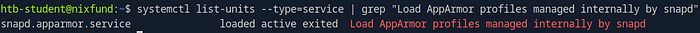

**Answer :** `snapd.apparmor.service`

---

# **Section 10: Task Scheduling**

### **1. What is the Type of the service of the “dconf.service”?**

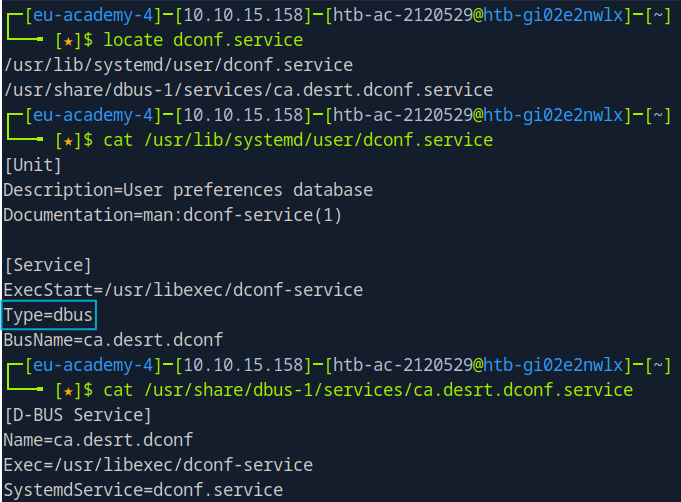

Instead of running multiple commands like shown above ,the command given below can also be used to obtain a one-line answer.

```bash
locate dconf.services | awk NR==1 | xargs cat | grep -i type
```

**Command breakdown:**

**1. `locate dconf.service`**

- This command quickly searches a pre-built database (not the live filesystem) for any file or directory path that contains the string “dconf.service”.
- It will output a list of all matching paths, one per line.

**2. `| awk NR==1`**

- The `|` (pipe) sends the list of paths from `locate` as input to the `awk` command.
- **`awk NR==1`** is a small program that processes the input. `NR` stands for "Number of Record" (line number). This command tells `awk` to print only the first line (`NR==1`) it receives and discard all others.

**3. `| xargs cat`**

- The `|` (pipe) takes the single file path from `awk` and sends it as input to `xargs`.
- **`xargs`** takes the text it receives from the input (the file path) and passes it as an argument to the command that follows.
- **`cat`** is the command that `xargs` will run. `cat` (short for concatenate) prints the contents of a file to the screen.

**4. `| grep -i type`**

- This takes the full content of the service file from `cat` and filters it. It searches for the string "type" (case-insensitive due to `i`) and prints only the line that contains it.

Here is the command executed on the HTB terminal:

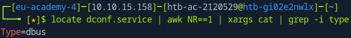

**Answer :** `dbus`

---

# **Section 11: Working with Web Services**

### **1. Find a way to start a simple HTTP server inside Pwnbox or your local VM using “npm”. Submit the command that starts the web server on port 8080 (use the short argument to specify the port number).**

```bash
http-server -p 8080
```

Before running the above command, first you have to install the **`http-server`** package from **`npm`** (node package manager), by running the below command:

```bash
sudo npm install http-server -y
```

**Answer :** `http-server -p 8080`

### **2. Find a way to start a simple HTTP server inside Pwnbox or your local VM using “php”. Submit the command that starts the web server on the localhost (127.0.0.1) on port 8080.**

```bash
php -S localhost:8080
```

You can also find some more information regarding `php` command by running `php --help` .

**Answer :** `php -S localhost:8080`

---

# **Section 12: File System Management**

### **1. How many partitions exist in our Pwnbox? (Format: 0)**

```bash
sudo fdisk -l
```

Here is the command executed on the HTB terminal:

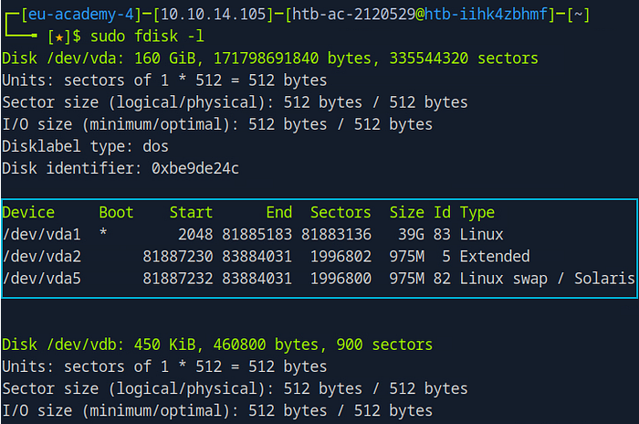

**Answer :** `3`

---