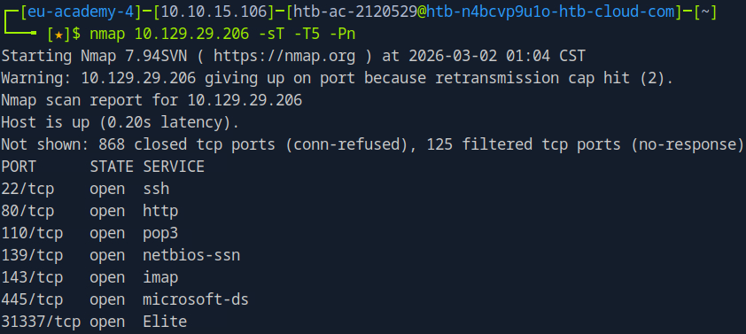
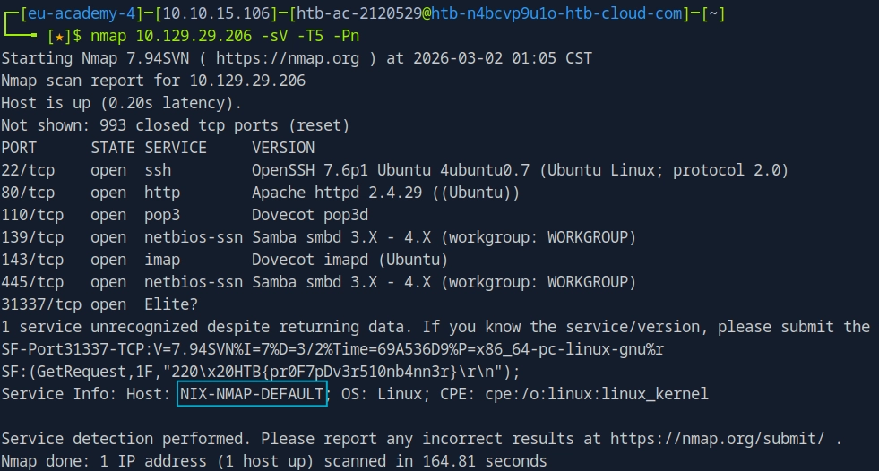
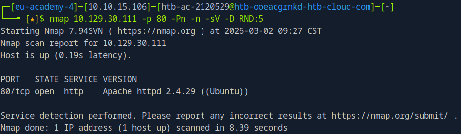
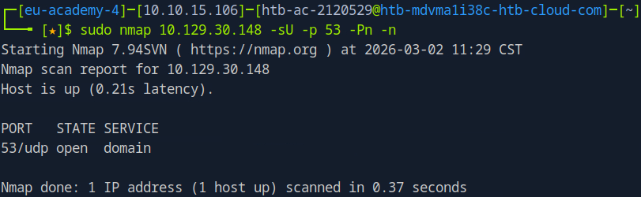

# Network Enumeration With Nmap

Created by: **4bh1-03**

This write-up documents my completion of the **`Network Enumeration using Nmap`** module under the **`Junior Cybersecurity Analyst`** job role path on **`Hack The Box`**. The module focuses on systematic network reconnaissance, service detection, and host discovery using Nmap as a primary enumeration tool.


In this write-up, I provide a structured walkthrough of the concepts covered in the module, including practical command usage, scan techniques, and result interpretation. It also includes step-by-step solutions to the lab exercises and answers to the module questions, demonstrating how enumeration findings can be analyzed and leveraged in real-world security assessments.

The objective of this write-up is not only to present solutions but to showcase a clear understanding of network scanning methodologies and their importance in the reconnaissance phase of penetration testing and defensive security operations.

---

# Section 3 : Host Discovery

### 1. **Based on the last result, find out which operating system it belongs to. Submit the name of the operating system as result.**

Last result:

```bash
Starting Nmap 7.80 ( https://nmap.org ) at 2020-06-15 00:12 CEST
SENT (0.0107s) ICMP [10.10.14.2 > 10.129.2.18 Echo request (type=8/code=0) id=13607 seq=0] IP [ttl=255 id=23541 iplen=28 ]
RCVD (0.0152s) ICMP [10.129.2.18 > 10.10.14.2 Echo reply (type=0/code=0) id=13607 seq=0] IP [ttl=128 id=40622 iplen=28 ]
Nmap scan report for 10.129.2.18
Host is up (0.086s latency).
MAC Address: DE:AD:00:00:BE:EF
Nmap done: 1 IP address (1 host up) scanned in 0.11 seconds
```

Take a look at `TTL` value of the received ICMP packet which is `128` . `Windows OS` typically use a `TTL` value of `128`.

[Check default TTL values of Different OS here.](https://subinsb.com/default-device-ttl-values/)

**Answer :** `Windows` 

---

# Section 4 : Host and Port Scanning

## Nmap Command Options Reference

Here is a consolidated list of the options that you cn use in the scans:

### **Targeting & Port Selection**

- **`p <port(s)>`**: Defines specific ports (e.g., `p 21`, `p 22-445`, or `p-` for all 65,535).
- **`-top-ports=<n>`**: Scans the most frequent "n" ports from the Nmap database.
- **`F`**: Fast scan (scans the top 100 ports).

### **Scan Types**

- **`sS`**: **TCP SYN Scan** (Half-open, default for root).
- **`sT`**: **TCP Connect Scan** (Full handshake).
- **`sU`**: **UDP Scan**.
- **`sV`**: **Services** and **Version Detection** (Probes services for version info).

### **Evasion & Optimization**

- **`Pn`**: **Disable Host Discovery.** Treats all hosts as online (skips the ping).
- **`n`**: **Disable DNS Resolution.** Speeds up the scan and stays quieter.
- **`-disable-arp-ping`**: Forces Nmap to use ICMP instead of ARP for local targets.

### **Debugging & Analysis**

- **`-packet-trace`**: Displays every packet sent and received in the terminal.
- **`-reason`**: Adds a column to the output explaining **why** a port was marked in its state (e.g., **`syn-ack`** or **`no-response`**).

### **Performance & Timing**

- **`T<0-5>`**: **Timing Templates.** Adjusts scan speed and aggressiveness.

| **Template** | **Name** | **Use Case** |
| --- | --- | --- |
| **`-T0`** | **Paranoid** | Extremely slow. Used to evade IDS by sending one packet every few minutes. |
| **`-T1`** | **Sneaky** | Very slow. Used for WAN links or to stay under the radar of older security systems. |
| **`-T2`** | **Polite** | Slows down to consume less bandwidth and reduce target machine stress. |
| **`-T3`** | **Normal** | **The Default.** Balanced for reliability and speed. |
| **`-T4`** | **Aggressive** | Faster and usually reliable on reasonably fast and stable networks. |
| **`-T5`** | **Insane** | Sacrifices accuracy for speed. Only recommended for very fast, local networks. |

### 1. **Find all TCP ports on your target. Submit the total number of found TCP ports as the answer.**

```bash
nmap 10.129.29.206 -sT -T5 -Pn
```



**Answer :** `7` 

### 2. **Enumerate the hostname of your target and submit it as the answer. (case-sensitive)**

```bash
nmap 10.129.29.206 -sV -Pn -T5
```



**Answer :** `NIX-NMAP-DEFAULT`

---

# Section 5 : Saving the Results

### **1. Perform a full TCP port scan on your target and create an HTML report. Submit the number of the highest port as the answer.**

```bash
nmap 10.129.29.206 -sT -T5 -Pn -oA nmap_scan
```

- **`oA nmap_scan`**: This is the "Output All" flag. It creates three different files for you:
    1. `nmap_scan.nmap` (Standard text)
    2. `nmap_scan.gnmap` (Grepable format—great for searching with commands)
    3. `nmap_scan.xml` (For importing into other tools like Metasploit)

After we run the above command, we get the following files in the current directory:


Now, let’s prepare the HTML report using the `nmap_scan.xml` file and the `xsltproc` command:

```bash
xsltproc nmap_scan.xml -o nmap_scan.html
```


Once completed, we get the HTML file. We can open it by typing `firefox nmap_scan.html` to open it in the browser.


**Answer :** `31337`

---

# Section 6 : Service Enumeration

### 1. **Enumerate all ports and their services. One of the services contains the flag you have to submit as the answer.**

```bash
nmap 10.129.29.206 -p- -sV -T5 -Pn -vv
```

**Output:**

```bash
┌─[eu-academy-4]─[10.10.15.106]─[htb-ac-2120529@htb-n4bcvp9u1o-htb-cloud-com]─[~]
└──╼ [★]$ nmap 10.129.29.206 -p- -sV -T5 -Pn -vv
Starting Nmap 7.94SVN ( https://nmap.org ) at 2026-03-02 01:44 CST
NSE: Loaded 46 scripts for scanning.
Initiating Parallel DNS resolution of 1 host. at 01:44
Completed Parallel DNS resolution of 1 host. at 01:44, 0.00s elapsed
Initiating SYN Stealth Scan at 01:44
Scanning 10.129.29.206 [65535 ports]
Discovered open port 139/tcp on 10.129.29.206
Discovered open port 110/tcp on 10.129.29.206
Discovered open port 22/tcp on 10.129.29.206
Discovered open port 143/tcp on 10.129.29.206
Discovered open port 80/tcp on 10.129.29.206
Discovered open port 445/tcp on 10.129.29.206
Warning: 10.129.29.206 giving up on port because retransmission cap hit (2).
SYN Stealth Scan Timing: About 17.40% done; ETC: 01:47 (0:02:27 remaining)
SYN Stealth Scan Timing: About 42.14% done; ETC: 01:46 (0:01:24 remaining)
Discovered open port 31337/tcp on 10.129.29.206
Completed SYN Stealth Scan at 01:46, 134.92s elapsed (65535 total ports)
Initiating Service scan at 01:46
Scanning 7 services on 10.129.29.206
Completed Service scan at 01:49, 160.95s elapsed (7 services on 1 host)
NSE: Script scanning 10.129.29.206.
NSE: Starting runlevel 1 (of 2) scan.
Initiating NSE at 01:49
Completed NSE at 01:49, 0.84s elapsed
NSE: Starting runlevel 2 (of 2) scan.
Initiating NSE at 01:49
Completed NSE at 01:49, 1.20s elapsed
Nmap scan report for 10.129.29.206
Host is up, received user-set (0.20s latency).
Scanned at 2026-03-02 01:44:15 CST for 298s
Not shown: 64824 closed tcp ports (reset), 704 filtered tcp ports (no-response)
PORT      STATE SERVICE     REASON         VERSION
22/tcp    open  ssh         syn-ack ttl 63 OpenSSH 7.6p1 Ubuntu 4ubuntu0.7 (Ubuntu Linux; protocol 2.0)
80/tcp    open  http        syn-ack ttl 63 Apache httpd 2.4.29 ((Ubuntu))
110/tcp   open  pop3        syn-ack ttl 63 Dovecot pop3d
139/tcp   open  netbios-ssn syn-ack ttl 63 Samba smbd 3.X - 4.X (workgroup: WORKGROUP)
143/tcp   open  imap        syn-ack ttl 63 Dovecot imapd (Ubuntu)
445/tcp   open  netbios-ssn syn-ack ttl 63 Samba smbd 3.X - 4.X (workgroup: WORKGROUP)
31337/tcp open  Elite?      syn-ack ttl 63
1 service unrecognized despite returning data. If you know the service/version, please submit the following fingerprint at https://nmap.org/cgi-bin/submit.cgi?new-service :
SF-Port31337-TCP:V=7.94SVN%I=7%D=3/2%Time=69A5405D%P=x86_64-pc-linux-gnu%r
SF:(GetRequest,1F,"220\x20HTB{pr0F7pDv3r510nb4nn3r}\r\n");
Service Info: Host: NIX-NMAP-DEFAULT; OS: Linux; CPE: cpe:/o:linux:linux_kernel

Read data files from: /usr/bin/../share/nmap
Service detection performed. Please report any incorrect results at https://nmap.org/submit/ .
Nmap done: 1 IP address (1 host up) scanned in 298.11 seconds
           Raw packets sent: 69486 (3.057MB) | Rcvd: 65964 (2.644MB)

```

**What is :**

```bash
SF-Port31337-TCP:V=7.94SVN%I=7%D=3/2%Time=69A5405D%P=x86_64-pc-linux-gnu%r
SF:(GetRequest,1F,"220\x20HTB{pr0F7pDv3r510nb4nn3r}\r\n");
```

**Full structure summary :**

```
SF-Port31337-TCP:
   Service Fingerprint
   for TCP port 31337

V=7.94SVN
   Nmap version used

%I=7
   Version detection intensity

%D=3/2
   Scan date

%Time=69A5405D
   Scan timestamp (hex)

%P=x86_64-pc-linux-gnu
   Scanner platform

%r
   Response to probe

(GetRequest,
   Probe name used

1F,
   Response length (hex)

"220\x20HTB{...}\r\n",
   Raw response from service which actually means 220 HTB{pr0F7pDv3r510nb4nn3r}
   \x = space in ASCII
)
```

**Answer :** `HTB{pr0F7pDv3r510nb4nn3r}`

---

# Section 7 : Nmap Scripting Engine

### **1. Use NSE and its scripts to find the flag that one of the services contain and submit it as the answer.**

First run a normal TCP port scan to identify the open ports in the target.


Since there is a `http` service (highly vulnerable) active on the port `80` , let’s try running an `nmap` scan against the port `80` and by setting the NSE script to `vuln` .

```bash
nmap 10.129.30.42 -p 80 -sV --script vuln
```

```bash
<SNIP>
|     	CNVD-2023-30859	5.3	https://vulners.com/cnvd/CNVD-2023-30859
|     	CNVD-2022-53582	5.3	https://vulners.com/cnvd/CNVD-2022-53582
|     	CNVD-2022-51059	5.3	https://vulners.com/cnvd/CNVD-2022-51059
|     	CNVD-2021-44766	5.3	https://vulners.com/cnvd/CNVD-2021-44766
|     	CNVD-2020-46278	5.3	https://vulners.com/cnvd/CNVD-2020-46278
|     	CNVD-2020-29872	5.3	https://vulners.com/cnvd/CNVD-2020-29872
|     	CNVD-2019-08941	5.3	https://vulners.com/cnvd/CNVD-2019-08941
|     	CNVD-2019-02938	5.3	https://vulners.com/cnvd/CNVD-2019-02938
|     	1337DAY-ID-33575	4.3	https://vulners.com/zdt/1337DAY-ID-33575*EXPLOIT*
|_    	PACKETSTORM:152441	0.0	https://vulners.com/packetstorm/PACKETSTORM:152441	*EXPLOIT*
|_http-csrf: Couldn't find any CSRF vulnerabilities.
| http-enum: 
|_  /robots.txt: Robots file

Service detection performed. Please report any incorrect results at https://nmap.org/submit/ .
Nmap done: 1 IP address (1 host up) scanned in 54.61 seconds

```

We find an interesting file `/robots.txt` . Let’s hit that route and check what we get.


**Answer :** `HTB{873nniuc71bu6usbs1i96as6dsv26}`

---

# Section 10 : Firewall and IDS/IPS Evasion - Easy Lab

### **Our client wants to know if we can identify which operating system their provided machine is running on. Submit the OS name as the answer.**

**Target IP :** `10.129.30.111` 

We use the decoy `-D` method to evade the IDS/IPS. We keep the random number of decoy IP addresses to `RND:5` , to check the port `STATE` . If it shows `open` we can proceed with the service version scan to know about the OS

```bash
┌─[eu-academy-4]─[10.10.15.106]─[htb-ac-2120529@htb-ooeacgrnkd-htb-cloud-com]─[~]
└──╼ [★]$ nmap 10.129.30.111 -p 80 -Pn -n -sS -D RND:5 --packet-trace
Starting Nmap 7.94SVN ( https://nmap.org ) at 2026-03-02 09:24 CST
SENT (0.0458s) TCP 82.32.197.39:40663 > 10.129.30.111:80 S ttl=38 id=42118 iplen=44  seq=2345566340 win=1024 <mss 1460>
SENT (0.0459s) TCP 156.54.45.219:40663 > 10.129.30.111:80 S ttl=42 id=42118 iplen=44  seq=2345566340 win=1024 <mss 1460>
SENT (0.0459s) TCP 74.65.74.251:40663 > 10.129.30.111:80 S ttl=37 id=42118 iplen=44  seq=2345566340 win=1024 <mss 1460>
SENT (0.0459s) TCP 179.88.65.154:40663 > 10.129.30.111:80 S ttl=39 id=42118 iplen=44  seq=2345566340 win=1024 <mss 1460>
SENT (0.0459s) TCP 10.10.15.106:40663 > 10.129.30.111:80 S ttl=53 id=42118 iplen=44  seq=2345566340 win=1024 <mss 1460>
SENT (0.0460s) TCP 212.117.78.213:40663 > 10.129.30.111:80 S ttl=40 id=42118 iplen=44  seq=2345566340 win=1024 <mss 1460>
SENT (1.0468s) TCP 82.32.197.39:40665 > 10.129.30.111:80 S ttl=54 id=14731 iplen=44  seq=2345435270 win=1024 <mss 1460>
SENT (1.0469s) TCP 156.54.45.219:40665 > 10.129.30.111:80 S ttl=40 id=14731 iplen=44  seq=2345435270 win=1024 <mss 1460>
SENT (1.0469s) TCP 74.65.74.251:40665 > 10.129.30.111:80 S ttl=56 id=14731 iplen=44  seq=2345435270 win=1024 <mss 1460>
SENT (1.0469s) TCP 179.88.65.154:40665 > 10.129.30.111:80 S ttl=59 id=14731 iplen=44  seq=2345435270 win=1024 <mss 1460>
SENT (1.0469s) TCP 10.10.15.106:40665 > 10.129.30.111:80 S ttl=47 id=14731 iplen=44  seq=2345435270 win=1024 <mss 1460>
SENT (1.0469s) TCP 212.117.78.213:40665 > 10.129.30.111:80 S ttl=41 id=14731 iplen=44  seq=2345435270 win=1024 <mss 1460>
RCVD (1.4068s) TCP 10.129.30.111:80 > 10.10.15.106:40663 SA ttl=63 id=0 iplen=44  seq=2168688177 win=64240 <mss 1362>
RCVD (1.4101s) ICMP [10.10.14.1 > 10.10.15.106 Echo reply (type=0/code=0) id=13722 seq=1] IP [ttl=64 id=7839 iplen=84 ]
RCVD (2.4623s) ICMP [10.10.14.1 > 10.10.15.106 Echo reply (type=0/code=0) id=13748 seq=1] IP [ttl=64 id=8145 iplen=84 ]
RCVD (3.4617s) ICMP [10.10.14.1 > 10.10.15.106 Echo reply (type=0/code=0) id=13774 seq=1] IP [ttl=64 id=8469 iplen=84 ]
RCVD (4.4629s) ICMP [10.10.14.1 > 10.10.15.106 Echo reply (type=0/code=0) id=13800 seq=1] IP [ttl=64 id=8681 iplen=84 ]
RCVD (5.4648s) ICMP [10.10.14.1 > 10.10.15.106 Echo reply (type=0/code=0) id=13826 seq=1] IP [ttl=64 id=9267 iplen=84 ]
RCVD (6.4622s) ICMP [10.10.14.1 > 10.10.15.106 Echo reply (type=0/code=0) id=13852 seq=1] IP [ttl=64 id=9971 iplen=84 ]
RCVD (7.4626s) ICMP [10.10.14.1 > 10.10.15.106 Echo reply (type=0/code=0) id=13878 seq=1] IP [ttl=64 id=10496 iplen=84 ]
Nmap scan report for 10.129.30.111
Host is up (1.4s latency).

PORT   STATE SERVICE
80/tcp open  http

Nmap done: 1 IP address (1 host up) scanned in 7.91 seconds

```

The `STATE` is `open`, which means the IDS/IPS is allowing the packets. Let’s run the below scan:

```bash
nmap 10.129.30.111 -p 80 -Pn -n -sV -D RND:5
```



**Answer :** `Ubuntu`

---

# Section 11 : Firewall and IDS/IPS Evasion - Medium Lab

### **After the configurations are transferred to the system, our client wants to know if it is possible to find out our target's DNS server version. Submit the DNS server version of the target as the answer.**

Let’s check if the port `53` [DNS] is `open/closed/filtered` on the target device by running the below scan:

```bash
sudo nmap 10.129.30.148 -sU -p 53 -Pn -n
```



Since the port is open, let’s perform a service version scan as done below to get the **target's DNS server version**.

```bash
┌─[eu-academy-4]─[10.10.15.106]─[htb-ac-2120529@htb-mdvma1i38c-htb-cloud-com]─[~]
└──╼ [★]$ sudo nmap 10.129.30.148 -sU -p 53 -sV -Pn -n --source-port 53
Starting Nmap 7.94SVN ( https://nmap.org ) at 2026-03-02 11:28 CST
Nmap scan report for 10.129.30.148
Host is up (0.21s latency).

PORT   STATE SERVICE VERSION
53/udp open  domain  (unknown banner: HTB{GoTtgUnyze9Psw4vGjcuMpHRp})
1 service unrecognized despite returning data. If you know the service/version, please submit the following fingerprint at https://nmap.org/cgi-bin/submit.cgi?new-service :
SF-Port53-UDP:V=7.94SVN%I=7%D=3/2%Time=69A5C8B6%P=x86_64-pc-linux-gnu%r(DN
SF:SVersionBindReq,57,"\0\x06\x85\0\0\x01\0\x01\0\x01\0\0\x07version\x04bi
SF:nd\0\0\x10\0\x03\xc0\x0c\0\x10\0\x03\0\0\0\0\0\x1f\x1eHTB{GoTtgUnyze9Ps
SF:w4vGjcuMpHRp}\xc0\x0c\0\x02\0\x03\0\0\0\0\0\x02\xc0\x0c")%r(DNSStatusRe
SF:quest,C,"\0\0\x90\x04\0\0\0\0\0\0\0\0")%r(NBTStat,105,"\x80\xf0\x80\x90
SF:\0\x01\0\0\0\r\0\0\x20CKAAAAAAAAAAAAAAAAAAAAAAAAAAAAAA\0\0!\0\x01\0\0\x
SF:02\0\x01\x006\xee\x80\0\x14\x01A\x0cROOT-SERVERS\x03NET\0\0\0\x02\0\x01
SF:\x006\xee\x80\0\x04\x01D\xc0\?\0\0\x02\0\x01\x006\xee\x80\0\x04\x01K\xc
SF:0\?\0\0\x02\0\x01\x006\xee\x80\0\x04\x01J\xc0\?\0\0\x02\0\x01\x006\xee\
SF:x80\0\x04\x01I\xc0\?\0\0\x02\0\x01\x006\xee\x80\0\x04\x01B\xc0\?\0\0\x0
SF:2\0\x01\x006\xee\x80\0\x04\x01E\xc0\?\0\0\x02\0\x01\x006\xee\x80\0\x04\
SF:x01G\xc0\?\0\0\x02\0\x01\x006\xee\x80\0\x04\x01F\xc0\?\0\0\x02\0\x01\x0
SF:06\xee\x80\0\x04\x01L\xc0\?\0\0\x02\0\x01\x006\xee\x80\0\x04\x01M\xc0\?
SF:\0\0\x02\0\x01\x006\xee\x80\0\x04\x01C\xc0\?\0\0\x02\0\x01\x006\xee\x80
SF:\0\x04\x01H\xc0\?");

Service detection performed. Please report any incorrect results at https://nmap.org/submit/ .
Nmap done: 1 IP address (1 host up) scanned in 15.41 seconds

```

**Answer :** `HTB{GoTtgUnyze9Psw4vGjcuMpHRp}` 

---

# Section 12 : Firewall and IDS/IPS Evasion - Hard Lab

### **Now our client wants to know if it is possible to find out the version of the running services. Identify the version of service our client was talking about and submit the flag as the answer.**

Let’s first check what service they are talking about by running a normal scan.

```bash
┌─[eu-academy-4]─[10.10.15.106]─[htb-ac-2120529@htb-q3fc6no6l4-htb-cloud-com]─[~]
└──╼ [★]$ nmap 10.129.2.47 -sS -Pn -n --disable-arp-ping
Starting Nmap 7.94SVN ( https://nmap.org ) at 2026-03-03 09:46 CST
Nmap scan report for 10.129.2.47
Host is up (0.20s latency).
Not shown: 869 closed tcp ports (reset), 129 filtered tcp ports (no-response)
PORT   STATE SERVICE
22/tcp open  ssh
80/tcp open  http

Nmap done: 1 IP address (1 host up) scanned in 33.10 seconds
```

These are all normal services which were present before too. Let’s try another scan by using 
`DNS Proxy` as a way to evade any IDS/IPS if present.

```bash
┌─[eu-academy-4]─[10.10.15.106]─[htb-ac-2120529@htb-q3fc6no6l4-htb-cloud-com]─[~]
└──╼ [★]$ nmap 10.129.2.47 -sS -Pn --source-port 53 --disable-arp-ping
Starting Nmap 7.94SVN ( https://nmap.org ) at 2026-03-03 08:56 CST
Nmap scan report for 10.129.2.47
Host is up (0.21s latency).
Not shown: 869 closed tcp ports (reset), 128 filtered tcp ports (no-response)
PORT      STATE SERVICE
22/tcp    open  ssh
80/tcp    open  http
50000/tcp open  ibm-db2

Nmap done: 1 IP address (1 host up) scanned in 8.40 seconds
```

Now we find something interesting, `ibm-db2` service!

<aside>


What is `ibm-db2` service?

IBM Db2 is a family of **data management products**, including a high-performance relational database management system (RDBMS) designed to help businesses manage, analyze, and store structured and semi-structured data. It is widely known for its scalability and efficiency in enterprise environments, particularly within the banking, manufacturing, and retail sectors.

</aside>

We will try running a service version scan on the port `50000` .

```bash
┌─[eu-academy-4]─[10.10.15.106]─[htb-ac-2120529@htb-q3fc6no6l4-htb-cloud-com]─[~]
└──╼ [★]$ nmap 10.129.2.47 -sS -sV -Pn --source-port 53 --disable-arp-ping
Starting Nmap 7.94SVN ( https://nmap.org ) at 2026-03-03 08:56 CST
Nmap scan report for 10.129.2.47
Host is up (0.21s latency).
Not shown: 869 closed tcp ports (reset), 128 filtered tcp ports (no-response)
PORT      STATE SERVICE    VERSION
22/tcp    open  ssh        OpenSSH 7.6p1 Ubuntu 4ubuntu0.7 (Ubuntu Linux; protocol 2.0)
80/tcp    open  http       Apache httpd 2.4.29 ((Ubuntu))
50000/tcp open  tcpwrapped
Service Info: OS: Linux; CPE: cpe:/o:linux:linux_kernel

Service detection performed. Please report any incorrect results at https://nmap.org/submit/ .
Nmap done: 1 IP address (1 host up) scanned in 70.35 seconds
```

Maybe that’s too aggressive, due to which it is getting filtered. Let’s directly connect to port `50000` using `netcat` .

```bash
┌─[eu-academy-4]─[10.10.15.106]─[htb-ac-2120529@htb-q3fc6no6l4-htb-cloud-com]─[~]
└──╼ [★]$ sudo ncat -s 10.10.15.106 -p 53 10.129.2.47 50000
220 HTB{kjnsdf2n982n1827eh76238s98di1w6}
```

This is a bit strange, instead of getting the version, we find a `FLAG` !!

**Answer :** `HTB{kjnsdf2n982n1827eh76238s98di1w6}`

---