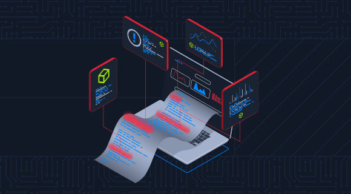
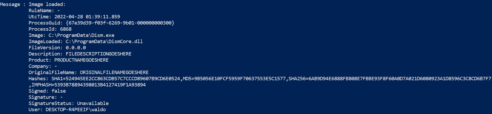
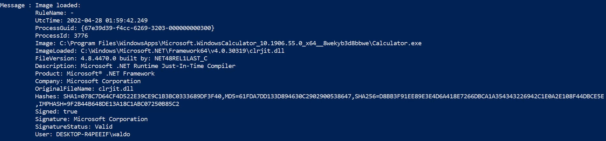
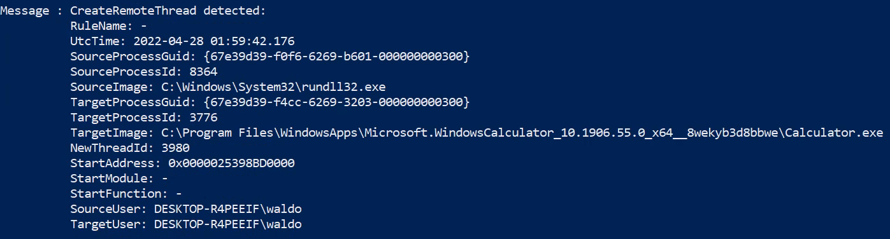
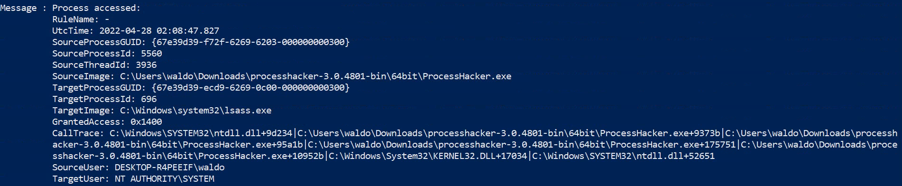
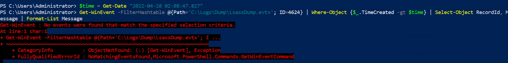
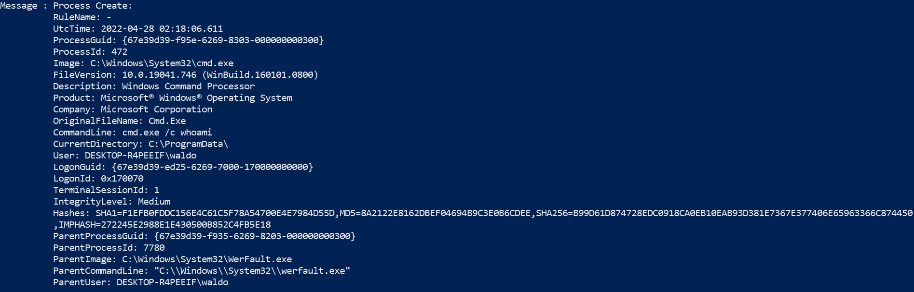

# Windows Event Logs & Finding Evil : Skill Assessment

Created by: **4bh1-03** 

This writeup documents the investigation of multiple malicious activities using Windows Event Logs. The objective was to analyze `.evtx` logs and identify attacker behavior such as DLL hijacking, unmanaged PowerShell execution, process injection, LSASS dumping, suspicious logins, and anomalous parent-child relationships.



## Common Methodology

Across all questions, the primary tool used was `Get-WinEvent`

### Key Event IDs

- **Event ID 1** → Process Creation
- **Event ID 7** → Image (DLL) Loaded
- **Event ID 8** → CreateRemoteThread (Injection)
- **Event ID 10** → Process Access (LSASS dump detection)
- **Event ID 4624** → Successful Logon

## General Approach

1. Filter logs using **Event IDs**
2. Narrow down using **keywords in Message**
3. Identify:
    - Suspicious paths
    - Abnormal parent-child relationships
    - Unexpected DLL loads
4. Extract the **responsible process**

---

## 1. **By examining the logs located in the "C:\Logs\DLLHijack" directory, determine the process responsible for executing a DLL hijacking attack. Enter the process name as your answer. Answer format: _.exe**

### Command Used

```powershell
Get-WinEvent -FilterHashtable @{
    Path='C:\Logs\DLLHijack\DLLHijack.evtx';
    ID=7
} | Where-Object {
    $_.Message -match "\.dll" -and
    $_.Message -notmatch "System32"
} | Select-Object RecordId, Message | Format-List Message
```

### Evidence



### Analysis

- Event ID 7 logs DLL loads
- Excluded `System32` to remove legitimate DLLs
- Focused on unusual load locations

### Finding

```powershell
Image: C:\ProgramData\Dism.exe
ImageLoaded: C:\ProgramData\DismCore.dll
```

### Reasoning

- `Dism.exe` normally runs from `System32`
- DLL loaded from same directory → classic DLL hijacking

### Answer : `Dism.exe`

---

## 2. **By examining the logs located in the "C:\Logs\PowershellExec" directory, determine the process that executed unmanaged PowerShell code. Enter the process name as your answer. Answer format: _.exe**

### Command Used

```powershell
Get-WinEvent -FilterHashtable @{
    Path='C:\Logs\PowershellExec\PowershellExec.evtx';
    ID=7
} | Where-Object {
    $_.Message -match "clr.dll|clrjit.dll|mscoree.dll" -and
    $_.Message -notmatch "powershell.exe"
} | Select-Object RecordId, Message | Format-List Message
```

### Evidence



### Analysis

- CLR DLLs indicate .NET execution
- PowerShell can be executed via .NET without powershell.exe

### Finding

```powershell
Image: Calculator.exe
ImageLoaded: clr.dll
```

### Reasoning

- Legit app behaving in suspicious context
- Indicates unmanaged PowerShell execution via injection

### Answer : `Calculator.exe`

---

## **3. By examining the logs located in the "C:\Logs\PowershellExec" directory, determine the process that injected into the process that executed unmanaged PowerShell code. Enter the process name as your answer. Answer format: _.exe**

### Command Used

```powershell
Get-WinEvent -FilterHashtable @{
    Path='C:\Logs\PowershellExec\PowershellExec.evtx';
    ID=8
} | Where-Object {
    $_.Message -match "Calculator.exe"
} | Select-Object RecordId, Message | Format-List Message
```

### Evidence



### Analysis

- Event ID 8 logs CreateRemoteThread (process injection)
- Identify:
    - SourceImage → attacker
    - TargetImage → victim (Calculator)

### Reasoning

- Calculator is the injected process
- SourceImage is the attacker process

### Answer : `rundll32.exe`

---

## 4. **By examining the logs located in the "C:\Logs\Dump" directory, determine the process that performed an LSASS dump. Enter the process name as your answer. Answer format: _.exe**

### Command Used

```powershell
Get-WinEvent -FilterHashtable @{
    Path='C:\Logs\Dump\LsassDump.evtx';
    ID=10
} | Where-Object {
    $_.Message -match 'TargetImage:.*lsass.exe'
} | Select-Object RecordId, Message | Format-List Message
```

### Evidence



### Analysis

- Event ID 10 logs process access
- LSASS access = credential dumping attempt

### Finding

```
SourceImage: ProcessHacker.exe
TargetImage: lsass.exe
```

### Reasoning

- Unauthorized access to LSASS is highly suspicious
- Indicates credential dumping

### Answer : `ProcessHacker.exe`

---

## 5. **By examining the logs located in the "C:\Logs\Dump" directory, determine if an ill-intended login took place after the LSASS dump. Answer format: Yes or No**

### Approach

1. Identify LSASS dump timestamp
2. Filter login events (Event ID 4624) after that time

### Evidence



### Answer : `No`

---

## 6. **By examining the logs located in the "C:\Logs\StrangePPID" directory, determine a process that was used to temporarily execute code based on a strange parent-child relationship. Enter the process name as your answer. Answer format: _.exe**

### Command Used

```powershell
Get-WinEvent -FilterHashtable @{
    Path='C:\Logs\StrangePPID\StrangePPID.evtx';
    ID=1
} | Where-Object {
    $_.Message -match "cmd.exe|powershell.exe"
} | Select-Object RecordId, Message | Format-List Message
```

### Evidence



### Analysis

Observed process chain:

```
WerFault.exe → cmd.exe → whoami.exe
```

### Why Suspicious?

- `WerFault.exe` should not spawn `cmd.exe`
- Indicates abuse of trusted process

### Reasoning

- `cmd.exe` used to execute command:
    
    ```powershell
    cmd.exe /c whoami
    ```
    
- Acts as temporary execution mechanism

### Answer : `WerFault.exe`

---

# Final Thoughts

This lab demonstrates key detection techniques:

- DLL Hijacking
- Process Injection
- Unmanaged PowerShell Execution
- Credential Dumping
- Behavioral Analysis

Understanding these patterns is essential for real-world SOC operations and incident response.

---