# Windows Fundamentals

Created by: **4bh1-03**

This write-up documents my learning journey through the **`Junior Cybersecurity Analyst path**: **Windows Fundamentals` .**

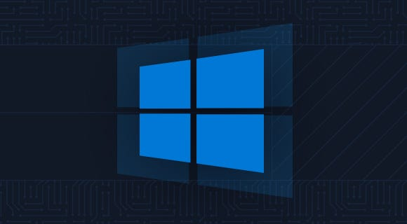

The purpose of this module is to build a strong foundational understanding of the Windows operating system from a security and system-administration perspective. Throughout this module, I explore core Windows concepts such as system architecture, user and group management, file systems, permissions, services, and essential security mechanisms.

This write-up is structured to clearly explain key concepts, commands, and observations encountered during the module, serving both as a personal reference and a beginner-friendly guide for others starting their Windows security journey.

---

# **Section 1 : Introduction to Windows**

First let’s connect to the given Windows target via the Remote Desktop Protocol (RDP) by typing the following command :

```bash
xfreerdp /v:<target_ip> /u:<username> /p:<password>
```

The command we use answers both the given questions. The command is as follows:

```powershell
Get-WmiObject -Class win32_OperatingSystem
```

- **Syntax Breakdown:** This command uses the **Windows Management Instrumentation (WMI)** framework to retrieve instances of the `Win32_OperatingSystem` class. WMI is the infrastructure for management data and operations on Windows-based operating systems.
- **Why is it needed:** For a Cybersecurity Analyst, this is a foundational reconnaissance command. It returns vital system details like the **Build Number**, **Service Pack version**, **Registered User**, and **OS Architecture (64-bit vs 32-bit)**. Knowing the exact build number is the first step in identifying if a system is vulnerable to specific kernel exploits.

**The Modern Switch: `Get-CimInstance`**

While `Get-WmiObject` is the classic tool taught in many labs, Microsoft has officially **deprecated** it in favor of the **CIM (Common Information Model)** cmdlets.

**Command:** **`Get-CimInstance -ClassName Win32_OperatingSystem`**

**Why the change?**

- **Protocol:** Legacy WMI uses **DCOM/RPC**, which is notoriously difficult to pass through firewalls. `Get-CimInstance` uses **WS-Management (WinRM)**, which is much more firewall-friendly and secure.
- **Performance:** CIM sessions are significantly faster, especially when querying multiple remote machines simultaneously.
- **Cross-Platform:** Since you’re a CSE student, you’ll appreciate this: CIM is an open standard. While WMI is Windows-specific, CIM is designed to work across different operating systems (like Linux via OMI).

Here is the command executed on HTB’s target windows machine:

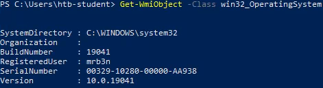

### **1. What is the Build Number of the target workstation?**

**Answer :** `19041`

### **2. Which Windows NT version is installed on the workstation? (i.e. Windows X — case sensitive)**

**Answer :** `Windows 10`

---

# **Section 2 : Operating System Structure**

The Windows root directory (usually `C:\`) contains core system folders required for the operating system, user management, application storage, and recovery. Understanding these directories is essential during system analysis, troubleshooting, and security assessments, as many attacks and misconfigurations revolve around them.

**Common standard root directories include:**

| Root Directories | Description |
| --- | --- |
| **`C:\Windows`** | The main operating system directory. It stores system binaries, configuration files, drivers, and core services. Unauthorized modifications here often indicate system compromise. |
| **`C:\Program Files`** | Contains 64-bit applications installed system-wide. Programs stored here typically require administrative privileges to modify. |
| **`C:\Program Files (x86)`** | Holds 16-bit and 32-bit applications on 64-bit systems. The separation helps maintain compatibility and system stability. |
| **`C:\Users`** | Stores user profiles, including documents, desktop files, and application data. This directory is frequently targeted for credential harvesting and data exfiltration. |
| **`C:\ProgramData`** | A hidden directory used by applications to store shared configuration and data accessible to all users. Misconfigured permissions here can lead to privilege escalation. |
| **`C:\PerfLogs`** | Contains performance monitoring logs. While rarely abused, it may appear during system diagnostics. |
| **`C:\Recovery`** | Stores files used for Windows recovery and troubleshooting. Access is typically restricted. |
| **`C:\System Volume Information`** | Contains system restore points and volume metadata. This directory is protected and inaccessible to standard users. |

### **1. Find the non-standard directory in the C drive. Submit the contents of the flag file saved in this directory.**

The non-standard directory which they are asking for is the `Academy` directory which contains a `flag.txt` file. The contents of the `flag.txt` file is the answer to the question.

Here is the command executed on HTB’s target windows machine:

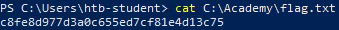

**Answer :** `c8fe8d977d3a0c655ed7cf81e4d13c75` 

---

# **Section 3 : File System**

### **1. What system user has full control over the `c:\users` directory?**

```powershell
icacls c:\users
```

**Syntax Breakdown:**

- **`icacls`**: Short for "Integrity Control Access Control List." It is a native Windows utility used to display or modify permissions for files and folders.
- **`c:\users`**: The target directory. Since this folder contains all user profiles on a system, it is a high-value target for security auditing.

Here is the command executed on HTB’s target windows machine:

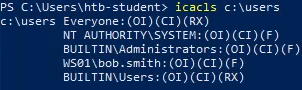

From the `icacls c:\users` output, the user that has **full control** over the `C:\Users` directory is: **`WS01\bob.smith`**

**Why `bob.smith` Is the Correct Answer (HTB Interpretation)?**

The key detail in the output is: **`WS01\bob.smith:(OI)(CI)(F)`**

This explicitly shows that **`bob.smith` has Full (`F`) permissions** on the `C:\Users` directory. HTB focuses on **explicitly listed users**, not implicit system behavior or theoretical privilege levels. Since `bob.smith` appears directly in the ACL with `(F)`, he is the correct answer.

**Answer :** `bob.smith`

---

# **Section 5 : Windows Services & Processes**

### **1. Identify one of the non-standard update services running on the host. Submit the full name of the service executable (not the DisplayName) as your answer.**

```powershell
Get-WmiObject Win32_Service | Where-Object {$_.PathName -match "update"}
 | Select-Object Name, PathName
```

**Syntax Breakdown:**

- **`Get-WmiObject Win32_Service`**: Unlike the previous `Get-Service` command, this pulls data from the WMI class `Win32_Service`.

**The key difference?**WMI includes the **PathName** (the actual file path to the executable), which standard service commands often omit.

- **`Where-Object {$_.PathName -match "update"}`**: This is a targeted filter. It scans the file paths of all services for the string "update". Using `match` allows for regular expression (regex) searching, making it very flexible.
- **`Select-Object Name, PathName`**: This cleans up the output, showing only the service's display name and the location of its binary on the disk.

Here is the command executed on HTB’s target windows machine:

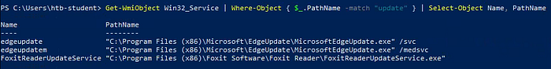

**Answer :** `FoxitReaderUpdateService.exe`

---

# **Section 8 : Interacting with the Windows Operating System**

### **1. What is the alias set for the ipconfig.exe command?**

```
Get-Alias | findstr "ipconfig"
```

**Syntax Breakdown:**

- **`Get-Alias`**: This cmdlet returns a list of all aliases currently defined in your PowerShell session. An alias is essentially a nickname or a shortened version of a longer command.
- **`|` (The Pipe)**: This takes the entire list of aliases and sends it to the next tool.
- **`findstr "ipconfig"`**: This is a classic CMD utility (not a native PowerShell cmdlet) used to search for specific strings of text. In this case, it’s looking for any line that mentions "ipconfig".

Here is the command executed on HTB’s target windows machine:

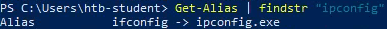

**Answer :** `ifconfig`

### **2. Find the Execution Policy set for the LocalMachine scope.**

```powershell
Get-ExecutionPolicy -List | ? {$_.Scope -match "LocalMachine"}
```

**Syntax Breakdown:**

- **`Get-ExecutionPolicy`**: This cmdlet checks the current "Execution Policy," which is a safety feature that controls the conditions under which PowerShell loads configuration files and runs scripts.
- **`List`**: This parameter displays the execution policy for all scopes (MachinePolicy, UserPolicy, Process, CurrentUser, and LocalMachine).
- **`? {$_.Scope -match "LocalMachine"}`**: This filters the list to specifically show the policy applied to the **`LocalMachine`** Scope.

Here is the command executed on HTB’s target windows machine:

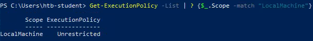

**Answer :** `Unrestricted`

---

# **Section 9 : Windows Management Instrumentation (WMI)**

> **Windows Management Instrumentation (WMI)** is Windows’ built-in framework that allows applications and administrators to **query system information and perform management tasks** such as monitoring processes, services, hardware, and system configuration.
> 

### **Key WMI Components**

- **WMI Service:** The core background service that coordinates all WMI operations. It acts as the intermediary between applications and system data.
- **Managed Objects:** The system components that WMI can manage, such as processes, services, disks, network adapters, and users.
- **WMI Providers:** Specialized components that know how to retrieve data or monitor events for specific managed objects and pass that information to WMI.
- **Classes:** Structured templates used by providers to represent system data. For example, `Win32_Process` defines how process information is stored and queried.
- **Methods:** Actions attached to classes that allow operations such as starting or stopping processes, services, or performing system tasks.
- **WMI Repository:** A database that stores static WMI data and class definitions. It does not store real-time system values.
- **CIM Object Manager (CIMOM):** The request dispatcher that routes queries from applications to the appropriate WMI providers and returns the results.
- **WMI API:** The interface that allows scripts, PowerShell, and applications to access WMI functionality.
- **WMI Consumer:** Any application, script, or tool that sends queries or commands to WMI, such as PowerShell scripts, monitoring tools, or administrative utilities.

### **How WMI Works**

A WMI consumer sends a query through the WMI API, the CIM Object Manager forwards it to the relevant provider, and the provider retrieves data from the managed object and returns it to the requester.

### **1. Use WMI to find the serial number of the system.**

```powershell
Get-WmiObject -Class Win32_OperatingSystem | select Serialnumber
```

**Syntax Breakdown:**

- **`Get-WmiObject -Class Win32_OperatingSystem`**: As we've seen, this pulls the full object containing all OS-related data.
- **`|` (The Pipe)**: This takes the massive object produced by the first command and passes it to the next.
- **`select Serialnumber`**: Short for `Select-Object`. It tells PowerShell: "I don't care about the Build Number or the Registered User right now—just show me the `Serialnumber` property."

Here is the command executed on HTB’s target windows machine:

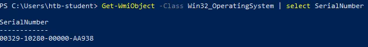

**Answer :** `00329–10280–00000-AA938`

---

# **Section 13 : Windows Security**

### **1. Find the SID of the bob.smith user.**

```powershell
Get-WmiObject -Class Win32_UserAccount | ? {$_.Name -match "bob.smith"}
```

**Syntax Breakdown:**

- **`Get-WmiObject -Class Win32_UserAccount`**: This pulls a list of all user accounts known to the system. This includes local accounts and, if the machine is part of a domain, cached domain accounts.
- **`? {$_.Name -match "bob.smith"}`**: This uses the `Where-Object` alias (`?`) to filter the results. It looks for any account name that matches the string `bob.smith`.

Here is the command executed on HTB’s target windows machine:

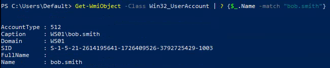

**Answer :** `S-1–5–21–2614195641–1726409526–3792725429–1003` 

### **2. What 3rd party security application is disabled at startup for the current user? (The answer is case sensitive).**

```powershell
reg query HKEY_CURRENT_USER\Software\Microsoft\CurrentVersion\Run
```

**Syntax Breakdown:**

- **`reg query`**: This tells Windows to search the Registry and display the values stored within a specific key.
- **`HKEY_CURRENT_USER` (HKCU)**: This is the "Hive." It targets the settings for the user currently logged in.
- **`...\CurrentVersion\Run`**: This is the specific "Key" path. Any application path listed in this folder is instructed to start automatically every time the user logs in.

Here is the command executed on HTB’s target windows machine:

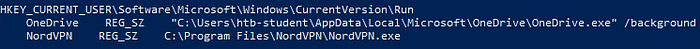

<aside>


**Wait, why not just use the Settings Menu?**
“While a casual user might use the ‘Startup Apps’ GUI, a Cybersecurity Analyst uses 
**`reg query`** because it provides the raw, unfiltered truth. In many attack scenarios, you won't have access to a GUI at all. Mastering the Registry via CLI allows you to audit persistence mechanisms and identify if security software has been silently disabled or diverted by an attacker—all from a remote terminal."

</aside>

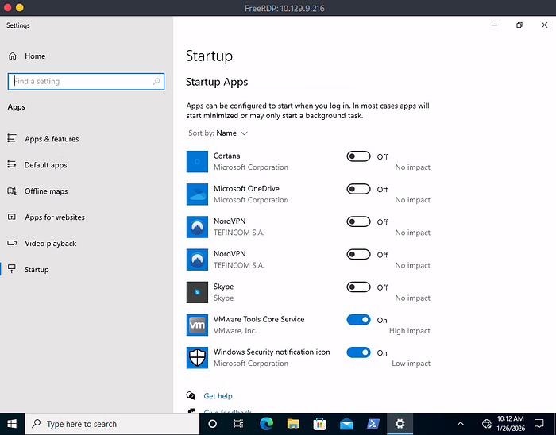

**Answer :** `NordVPN` 

---

# **Section 14 : Skills Assessment — Windows Fundamentals**

> ***TASKS***
> 

### **1. Creating a shared folder called Company Data**

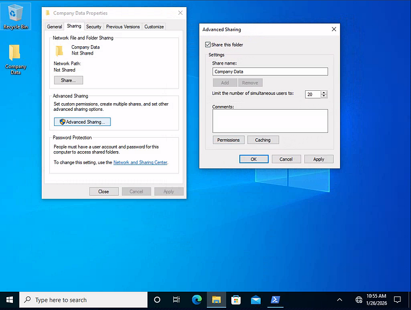

### **2. Creating a subfolder called HR inside of the Company Data folder**

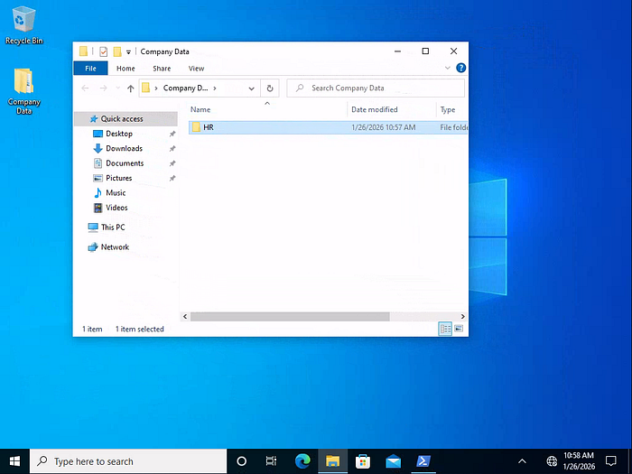

### **3. Creating a user called Jim**

Open Computer Management and navigate to `Local Users and Groups\Users` . Under `More Actions` find the `New User...` action and enter the details to add `Jim` as a user. Make sure to uncheck `User must change password at logon` .

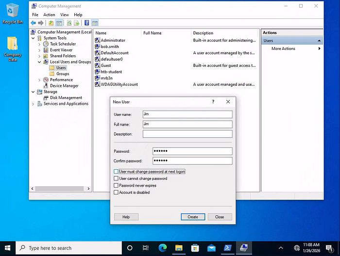

### **4. Creating a security group called HR**

Open Computer Management and navigate to `Local Users and Groups\Groups` . Under `More Actions` find the `New Group...` action and enter the details to add `HR` as a group.

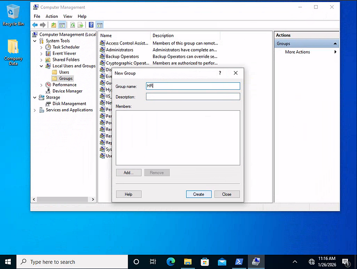

### **5. Adding Jim to the HR security group**

Select `HR` Group from the list. Under `HR > More Actions` find the `Add to Group...` action, click on `Add...` and find the user `Jim` .

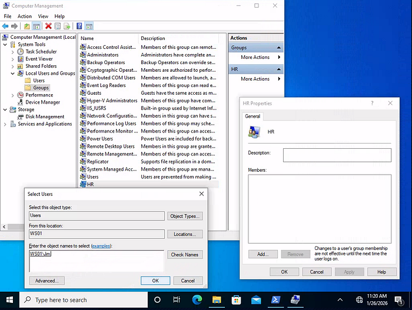

Click `OK` and `Apply` to successfully add the user to the required group.

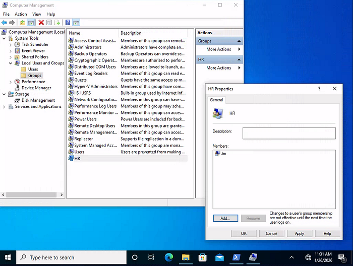

### **6. Adding the HR security group to the shared Company Data folder and NTFS permissions list**

- Adding `HR` security group to the shared **`Company Data`** folder with `Change` and `Read` permissions allowed.

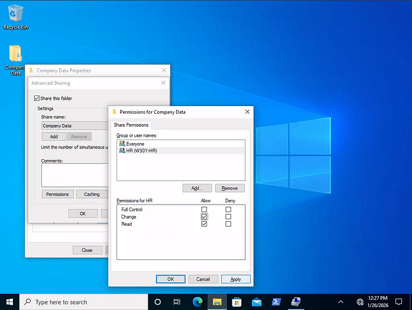

- Removing the default group `Everyone` .

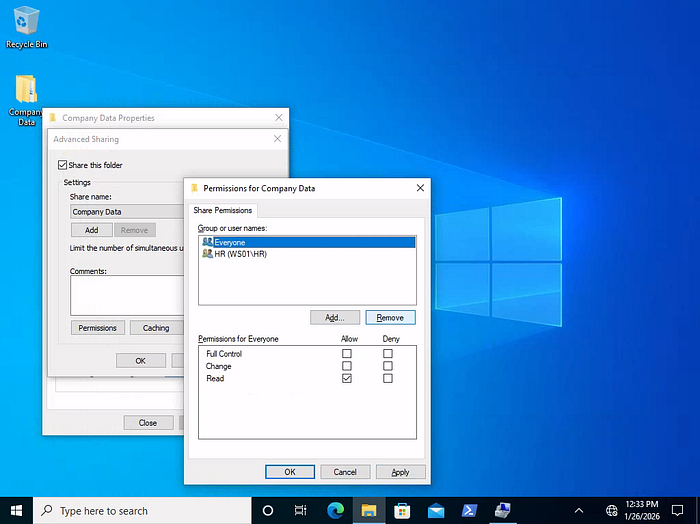

- `Disabling Inheritance` before issuing specific NTFS permissions.

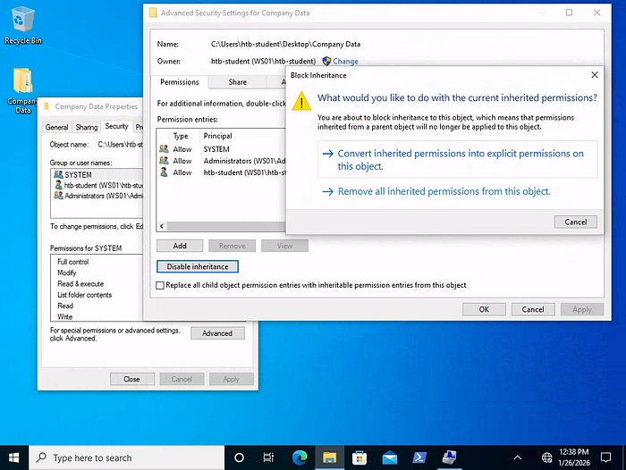

- Adding `HR` security group to NTFS permissions list of **`Company Data`** folder.

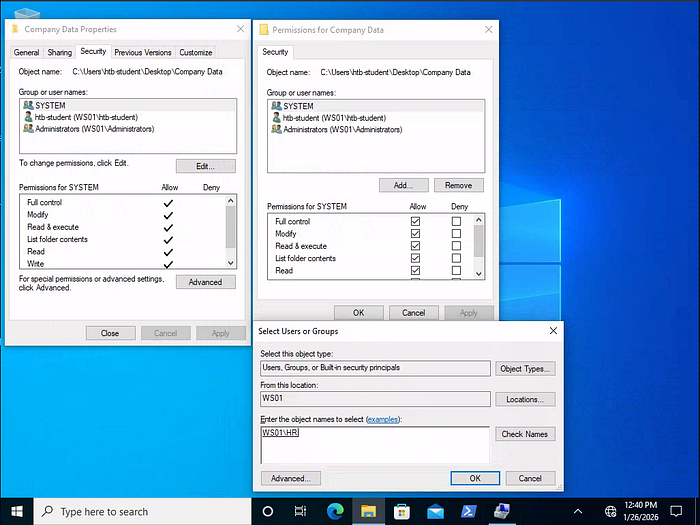

- Allowing NTFS permissions: `Modify`, `Read & Execute`, `List folder contents`, `Read`, and `Write` .

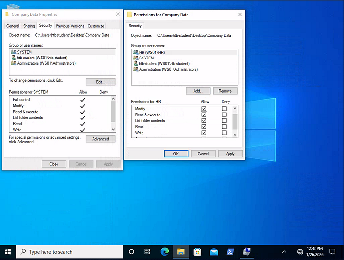

### **7. Adding the HR security group to the NTFS permissions list of the HR subfolder**

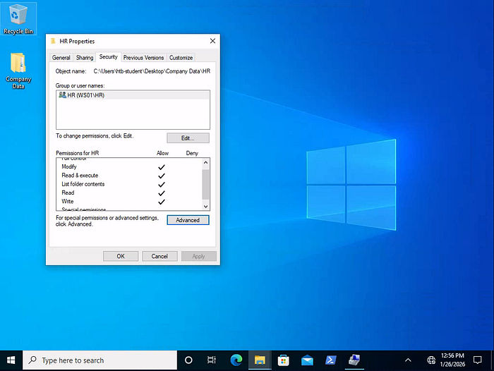

- `Disable Inheritance` before issuing specific NTFS permissions
- Remove the default group that is present
- Allow NTFS permissions: `Modify`, `Read & Execute`, `List folder contents`, `Read`, and `Write` .

---

> ***QUESTION AND ANSWERS***
> 

### **1. What is the name of the group that is present in the Company Data Share Permissions ACL by default?**

**Answer :** `Everyone`

### **2. What is the name of the tab that allows you to configure NTFS permissions?**

**Answer :** `Security` 

### **3. What is the name of the service associated with Windows Update?**

```powershell
Get-Service | ? {$_.DisplayName -match "update"}

OR

Get-WmiObject -Class Win32_Service | ? {$_.DisplayName -match "update"}
| Select-Object Name, DisplayName
```

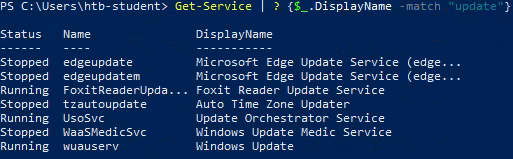

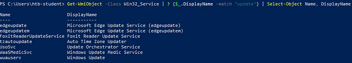

**Answer :** `wuauserv` 

### **4. List the SID associated with the user account Jim you created.**

```powershell
wmic useraccount get name,sid

OR

Get-WmiObject -Class Win32_UserAccount | ? {$_.Name -match "Jim"}
```

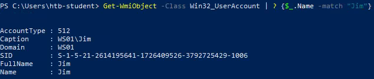

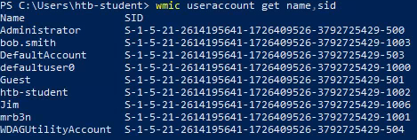

**Answer :** `S-1–5–21–2614195641–1726409526–3792725429–1006`

### **5. List the SID associated with the HR security group you created.**

```powershell
Get-LocalGroup | ? {$_.Name -match "HR"} | Select-Object Name, SID

OR

(Get-LocalGroup "HR").SID

OR

wmic group get name,sid

OR

Get-WmiObject -Class Win32_Group | ? {$_.Name -match "HR"}
```

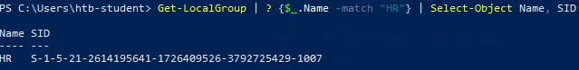

**Answer :** `S-1–5–21–2614195641–1726409526–3792725429–1007`

---

# **My Key Takeaways**

- **The Power of the CLI:** I’ve learned that while the GUI is helpful for daily tasks, the Command Line is where the real truth lies when I’m working in remote or restricted environments.
- **Objects Over Text:** Mastering the PowerShell pipeline — filtering with **`Where-Object`** and formatting with **`Select-Object`**—is how I now cut through system noise to find exactly what I need.
- **Living off the Land:** By using native tools like **Integritry Control Access Control List** **`icacls`**, **Service Controller** **`sc`**, and **`Get-WmiObject`**, I’ve discovered how to identify misconfigurations and potential vulnerabilities without needing any external tools.

As I continue my studies in **Cybersecurity**, these fundamentals will serve as the bedrock for my future work in Privilege Escalation and Active Directory exploitation. This module wasn’t just about learning “How Windows works” — it was about learning how I can defend it.

---

# **Windows Fundamentals: Command Cheat Sheet**

Below is a summary of the core commands I used to navigate and audit the Windows environment during this module.

| **Category** | **Command / Class** | **Full Name / Description** | **Primary Purpose** |
| --- | --- | --- | --- |
| **Service Management** | `sc qc [service]` | Service Controller (Query Config) | View binary paths and service startup accounts. |
|  | `Get-Service` | PowerShell Service Cmdlet | List and filter services by name or status. |
|  | `Get-WmiObject` | Windows Management Instrumentation | Perform deep system queries (e.g., binary locations). |
| **Security & Permissions** | `icacls` | Integrity Control Access Control List | View or modify file and folder permissions (ACLs). |
|  | `Get-ExecutionPolicy` | PowerShell Script Policy | Check script execution restrictions (e.g., RemoteSigned). |
|  | `reg query [path]` | Registry Query | Inspect Registry for persistence or system settings. |
| **User & Group Recon** | `Win32_UserAccount` | WMI User Class | Retrieve user SIDs, account status, and password info. |
|  | `Win32_Group` | WMI Group Class | List local security groups to identify high-value targets. |
|  | `Get-Alias` | PowerShell Alias Cmdlet | Map command shortcuts and aliases. |

---